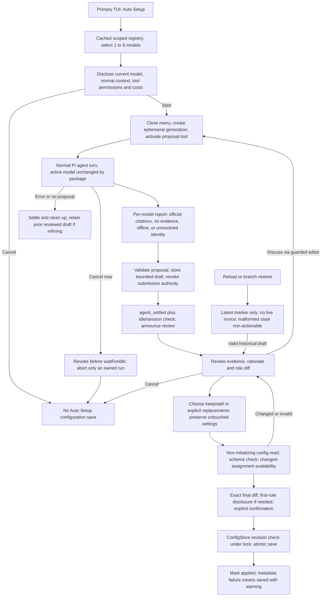

# Auto Setup: Agent-Driven Evidence, Review, and Confirmed Role Configuration

> Generated 2026-09-06T08:18:22.574Z · sha256:e1f29e2c4db7d428067f8ff3b6557668ec33592fc7d9456369fdd8417aa94642

## Summary

Revised after review: add a primary-TUI Auto Setup workflow for up to eight available models, using the current Pi agent and its configured tools or clearly labelled offline knowledge. Keep proposals separate from configuration, make cancellation and session recovery explicit, and require user confirmation for every Auto Setup-owned configuration save. The normal agent is not a read-only sandbox.

## Outcome

Users can select candidate models, obtain an honest per-model report and reasoned role recommendations, discuss revisions with their current Pi model, choose how to handle existing roles, and explicitly approve a fresh configuration diff. Auto Setup itself never switches the model or saves roles during research or discussion; other tools retain their normal host permissions.

## Acceptance criteria
- The existing `/model-roles` menu gains Auto Setup and exact `auto-setup`, `auto-setup review`, and `auto-setup cancel` command paths. `/model-roles auto` retains its current meaning. Auto Setup is limited to a primary TUI session and cached scope-filtered available models; selecting zero or more than eight models cannot start research.
- Before each initial research run, the UI names the current model and explains normal conversation/provider exposure, configured tool costs and permissions, ordinary Pi history retention, and offline fallback. Auto Setup adds no search credentials or direct search transport and does not change other tools' permissions. Offline means no web evidence, not necessarily local or network-free inference.
- The menu closes before a consented `pi.sendUserMessage` research or refinement turn begins. Auto Setup never calls `setModel` or `setThinkingLevel`. Its injected inputs bypass role routing. Every setup discussion exchange uses the guarded Discuss/refine editor and extension-generated message path; ordinary chat is not implicitly captured as setup discussion.
- Only a live, session/branch/generation-bound proposal tool may accept a new draft. Its execute handler has no configuration-save capability. Acceptance of a proposal closes that generation's submission authority, but review is announced only after `agent_settled` and a fresh idle/session check. No modal review opens from tool execution.
- `auto-setup cancel` invalidates submission authority immediately, before any `waitForIdle`. It aborts a still-running Pi turn only when ownership is established; otherwise it explains how to stop the normal agent with Escape. Abort/error/no-proposal/dispatch-failure paths clean up the package's tool and pending state. Late or unrelated submissions cannot revive cancelled work.
- Every selected model has an evidence record with one of: official sources cited by the agent, search attempted but no official evidence found, offline knowledge, or unresolved identity. A single report can mix these states. Citations are agent-reported, not independently verified. Records include research/access dates, publication date when known, and benchmark result/metric/harness/split/version caveats when available; unknown facts remain unknown.
- Use exact registry provider/model references for assignments. A serving gateway ID may be associated with an upstream developer model only through an explicitly cited mapping; fuzzy or assumed alias equivalence is rejected. Unresolved mappings do not prevent clearly caveated offline recommendations.
- Each proposed role explains when it applies, why its model and supported effort fit, evidence references or offline basis, uncertainty, and a meaningful trade-off against another selected model when one exists. Selected models do not require one role each; the report may recommend no new roles or mark a candidate not recommended. No invented benchmark, latency, or cost values are permitted by the prompt/report contract.
- Review displays the per-model report, caveats, proposed settings, and field-level diff. The user chooses preserve/add, individual conflict replacements, or separately confirmed replacement of custom roles. Default changes are explicit and separate. Auto Setup preserves `enabled`, `selectorTimeoutMs`, manual/auto mode, and the current model/effort; the first-custom-role save retains the existing future-routing cost/privacy confirmation.
- Before an Auto Setup save, re-read configuration without initialization, fail on a missing/invalid/conflicting snapshot, validate the complete resulting RoleConfig, and recheck availability/effort only for added or changed assignments. Untouched unavailable or out-of-scope roles remain intact. Save exactly the reviewed immutable diff against its revision through ConfigStore; changed data requires a new review and confirmation.
- Persist only bounded, schema-validated report/draft and lifecycle metadata in Pi custom session entries, never live submission authority. Restored drafts are review-only until a new explicit action. A malformed or unsupported latest lifecycle marker makes that draft non-actionable; an older draft must not silently become current. Cancelled/applied markers supersede prior drafts.
- Auto Setup's own configuration path performs no write before final confirmation. This is not a guarantee that the ordinary agent or third-party tools cannot modify files. Existing primary-TUI default-file initialization remains unchanged and is not triggered by research/review. Rejecting a save before its commit leaves YAML unchanged by Auto Setup; failures recording an applied session marker after a successful save are reported as saved-with-warning, not as an unchanged file.
- Concrete bounds are enforced before draft persistence: eight candidates; at most three source records per candidate and 24 total; at most 31 proposed custom roles plus an optional default replacement; 2,048 UTF-16 code units per URL; 1,500 Unicode characters per model assessment; 1,000 per role rationale; 500 per effort rationale; at most four 500-character caveats per model; 64 KiB UTF-8 for serialized tool arguments and each custom entry; 32 KiB UTF-8 for the package-generated research/refinement message. Existing role/config limits also apply. Oversized drafts are rejected, not silently truncated.
- An early faux-SDK contract test proves dispatch, guarded submission, settling, cancellation, tool activation/cleanup, and model preservation before full UI work. Automated unit, integration, documentation-contract, and package-smoke coverage passes `npm run check`. Human TUI acceptance is recorded separately with pass/fail/not-run results; no runtime dependency or YAML schema migration is added.

## Scope

### In scope
- Primary-TUI commands and menu, cached scope-aware model multi-selection capped at eight, start disclosure, and a normal active-agent research turn using the user's configured tools.
- A proposal-only tool with ephemeral per-generation authority, explicit run lifecycle and cancellation, guarded multi-turn discussion, bounded session drafts, review, and confirmation.
- Per-model mixed evidence states, dated agent-reported citations, documented upstream-model mapping, offline/no-evidence handling, and a useful role/effort recommendation rubric.
- User-chosen merge/replacement behavior, preservation of untouched settings and unavailable roles, existing first-role routing disclosure, revision checks, and atomic ConfigStore persistence.
- An early Pi SDK contract-test gate, deterministic fake UI/provider/tool fixtures, regression tests, separate human terminal acceptance, and aligned README/configuration/compatibility/API/changelog updates.
- Replacement of the prior plan's overbroad safety claims, underspecified lifecycle, binary evidence mode, permissive state restoration, and all-roles availability checks.

### Out of scope
- Bundling or configuring a search provider, issuing package-owned search/fetch/model-completion requests, managing credentials, or introducing a research adapter protocol.
- A sandbox for the normal Pi agent or arbitrary third-party tools. Tool-call hooks can block individual operations but cannot establish universal read-only behavior for arbitrary configured tools.
- Switching the active model or effort, changing Pi defaults, altering other tools' permissions, silently resuming routing, or enabling global routing while applying a proposal.
- A benchmark database, background crawling, telemetry, benchmark execution, universal aggregate scores, guaranteed optimum model selection, or guaranteed research cost/time bounds.
- Guessed gateway/alias canonicalization, presenting citations as independently verified, or treating offline model knowledge as measured benchmark evidence.
- Headless/RPC/print/subagent Auto Setup UI, named profiles, YAML research fields, persistent live request tokens, and automatic research continuation after reload or navigation.

## Constraints
- Keep RoleConfig schema version 1 and its existing public selection API unchanged. Auto Setup proposes ordinary roles; transient report data does not belong in config.yaml.
- Preserve the chosen normal-agent approach: use the current model and user-configured tools without choosing a search vendor, provisioning accounts, or changing unrelated tool policy.
- Scope guarantees precisely: the package's draft/submission path cannot save configuration; normal Pi tools are not sandboxed. Do not claim prompt instructions or structural validation prove that arbitrary tool activity is harmless or source claims are true.
- Auto Setup must never override a manual model/effort change. Such changes invalidate live generation authority; completed reports remain reviewable, and a later exchange captures/discloses the then-current model.
- Treat research and each refinement as a separate bounded submission generation. Do not leave the proposal tool accepting calls during review, unrelated chat, cancelled state, or restored history.
- Do not hold a menu or wait for agent completion inside the proposal tool. Use agent_settled for completion notification, checking idle/session/generation again because other extensions may launch work.
- Do not wait for idle before cancelling. Abort only work proven to belong to the active setup generation; tool/provider cancellation is cooperative and cannot undo completed requests or charges.
- Do not intentionally collect credentials, provider headers/endpoints, raw pages, normal conversation copies, or free-form discussion into custom state. Bounded model-generated text can still contain unwanted material; show it for review and document ordinary Pi/tool history retention rather than promising automatic secret detection.
- Keep availability checks cached and synchronous. Validate the full final schema but only require current availability/supported effort for newly added or changed assignments. Preserve untouched unavailable roles and inherited defaults.
- Review/load must not call initialize/reset or overwrite a last-valid snapshot after a failed reload. ConfigStore.error, missing files, revisions, and branch/generation changes must be handled explicitly.
- Confirmation authorizes one immutable final configuration and revision, not a fresh recomputed draft. A changed diff must be displayed and confirmed again; revision checks remain under ConfigStore's lock.
- Keep Auto Setup-specific limits in its own module, reuse existing role/config limits, add no runtime dependency, and do not change routing classification policy.

## Findings
- **The existing adapter provides cached scope-aware candidates, not benchmark or identity-mapping evidence.**
  - `src/pi/adapters.ts` `availableModels()` filters `ctx.modelRegistry.getAvailable()` against `ctx.scopedModels` and exposes exact refs, supported efforts, context window, and image support.
  - `src/core/types.ts` `AvailableModel` contains neither benchmark results nor reliable mappings between a gateway ID and its upstream developer model.
- **Normal agent execution is supported, but it is not a universal read-only boundary.**
  - Installed Pi extension types expose `sendUserMessage`, `registerTool`, `getActiveTools`, and `setActiveTools`; they do not expose a generic callable registry for invoking another extension's web tool.
  - Pi `docs/extensions.md` `tool_call` supports blocking individual calls. That does not sandbox arbitrary configured tools or make a prompt-only no-write instruction enforceable.
  - The user chose normal-agent research with existing configured tools and offline knowledge as fallback, not a dedicated search transport.
- **Pi has a settled event suitable for readiness, and cancellation cannot share the current unconditional idle wait.**
  - Installed Pi `docs/extensions.md` distinguishes `agent_end` from `agent_settled`: retries, auto-compaction retries, and queued continuations may follow agent_end.
  - `src/ui/menu.ts:243` currently calls `ctx.waitForIdle()` before parsing/dispatching role subcommands. A new cancellation command must be handled before that wait.
  - Pi's send-user-message example returns from the command after dispatch; research completion is not the command handler's synchronous result.
- **Extension inputs bypass role selection, whereas normal idle interactive replies can switch models.**
  - `src/pi/controller.ts` `input()` returns early for non-interactive sources, but ordinary idle interactive text enters model selection when routing is enabled.
  - Therefore setup discussion must stay in an explicit guarded input path rather than assuming any later chat reply remains on the research model.
- **Existing role preservation and routing disclosure must be reused, not weakened by Auto Setup.**
  - `docs/configuration.md` states that unavailable, unauthenticated, and out-of-scope saved models remain in YAML with warnings.
  - `src/ui/menu.ts` rechecks the edited role's model, not every untouched role.
  - `src/ui/menu.ts:115–123` contains the first-custom-role future-selector cost/provider disclosure. It is outside the menu-local save helper and will not be preserved merely by extracting that helper.
- **ConfigStore retains last-valid snapshots on load errors and already supplies the correct write boundary.**
  - `src/config/store.ts` `load(false)` is non-initializing and may return the prior snapshot with `error` set after an invalid reload; callers must check that error.
  - `save()` serializes, then revision-checks under an exclusive lock before private-temp-file sync and atomic rename. Serialization itself is not a configuration write.
  - `RolesController.reload()` calls `load(true)`, so it should not be reused as a supposedly read-only Auto Setup preflight.
- **Session history is suitable for draft recovery, but a historical record must not restore live authority.**
  - `src/pi/session-state.ts` already demonstrates branch-local custom-entry restoration and conservative handling of unknown state.
  - Pi custom entries do not enter model context by themselves; the coordinator must explicitly include a bounded reviewed draft in a refinement prompt.
  - A malformed latest marker cannot safely be skipped if an earlier draft could have been cancelled, superseded, or applied.
- **The existing fake UI and SDK harness can support a focused integration gate before broad implementation.**
  - `test/support/sdk.ts` uses faux providers and real Pi extension/session APIs without live credentials.
  - `test/support/fake-ui.ts` needs deterministic custom-component input support for a multi-select and report viewer.
  - `package.json` `npm run check` runs automated formatting, lint, typecheck, unit, build, and integration checks. `test/manual/tui-checklist.md` explicitly requires separate human verification.

## Architecture design

Add a small session coordinator beside the existing role controller, with pure evidence/proposal validation and merge logic. Each consented research/refinement exchange gets an ephemeral submission generation and uses the current normal Pi agent. A proposal-only tool stores a bounded draft and closes its submission authority; agent_settled announces when it is safe to review. Cancellation invalidates authority immediately and aborts only an owned turn. Restored drafts are review-only. The user selects a merge strategy, sees the exact diff and required disclosures, and confirms one revision-checked save. Neither the package nor this plan claims to sandbox other normal-agent tools.

## Implementation tasks
### T0 — Prove Pi lifecycle and tool handoff before full UI work

**What:** Add a small faux-SDK contract test that establishes the required normal-agent dispatch, proposal handoff, settled notification, cancellation, and tool cleanup behavior before implementing the feature's full production UI.

**Why:** The original plan deferred the highest-risk host integration until after the UI. This gate makes lifecycle and active-model assumptions executable early and prevents building on an unverified completion or cancellation model.

**How:** Use an inline test extension and existing sdkHarness with synthetic tools and faux responses. Simulate a research command that returns after sendUserMessage, a proposal-only tool, a delayed sibling tool, automatic/queued continuation, and agent_settled. Prove model/effort remain unchanged by the test extension and extension inputs bypass the roles selector. Exercise cancel while a tool is pending, dispatch failure, no submission, and dynamic activation/deactivation. Establish an explicit owned-turn correlation rule using generation/session/branch and observed dispatch/lifecycle; if ownership is ambiguous, cancellation must revoke proposal authority without aborting unrelated work. Keep the spike as a repeatable contract test, not a separate shipped research implementation.

**Files/modules:** test/support/sdk.ts, test/integration/auto-setup-host-contract.test.ts

**Depends on:** None

**Validation:**
- The contract test passes with faux providers/tools only and no credentials or network.
- A delayed sibling tool and queued continuation demonstrate that accepted submission and agent_end do not imply readiness; agent_settled is the readiness gate.
- Cancellation invalidates immediately without awaiting the blocked tool; ambiguous ownership does not abort an unrelated run.
- Record any unsupported host assumption as a blocker to dependent implementation rather than silently changing the user-selected execution approach.

#### Subtasks
##### T0.1 — Provide minimal synthetic tool and lifecycle fixtures

**What:** Extend sdkHarness only enough to drive tool-call sequences and observe lifecycle/model identity.

**Why:** The feature needs real host contract evidence, not only mocks of expected APIs.

**How:** Retain existing harness defaults; add optional synthetic tools/response hooks and deferred promises for controlled cancellation/continuation. Do not modify production behavior or require a real search extension.

**Files/modules:** test/support/sdk.ts, test/integration/auto-setup-host-contract.test.ts

**Depends on:** T0

**Validation:**
- Existing integration suites keep their current behavior with default harness options.
- Fixtures record only synthetic tool calls and contain no auth or private prompt data.

##### T0.2 — Gate implementation on dispatch, settle and cancellation contracts

**What:** Prove the minimal request-to-draft lifecycle, cleanup and ownership rules.

**Why:** It must be safe to cancel before idle and avoid opening review while the host is still executing.

**How:** Assert command return, extension-input bypass, active-model identity, proposal-only tool behavior, late-submission rejection, agent_settled ordering and removal of only the package-owned tool name. Cover an externally disabled tool and startup/reload defaults.

**Files/modules:** test/integration/auto-setup-host-contract.test.ts

**Depends on:** T0.1

**Validation:**
- The test fails if cancellation calls waitForIdle first, review opens from tool execution, a late call is accepted, or the extension clobbers an unrelated active tool.
- Do not proceed to production UI until these tests pass on the documented Pi version.

### T1 — Define mixed evidence, useful recommendations and deterministic merge contracts

**What:** Create provider-agnostic types, concrete limits, strict validators, recommendation requirements, and pure diff/merge logic.

**Why:** Evidence is mixed across models and structurally valid citations are not verified facts. Ordinary role changes must remain exact, explainable, and separate from the research narrative.

**How:** Add `src/auto-setup/types.ts`, `limits.ts`, `validation.ts`, and `merge.ts`. Use one assessment per exact selected ModelRef with status `official_sources_cited`, `no_official_evidence_found`, `offline_knowledge`, or `identity_unresolved`. Distinguish the serving provider/ref from an upstream developer identity; accept an association only with a cited mapping, never by fuzzy matching. Source records contain agent-reported title, HTTPS URL, reported access date, publication date or unknown, benchmark name/result/metric and harness/split/version details or unknown. The coordinator stamps receipt time separately. No-source and offline records cannot claim measured results or verified citations; identity-unresolved records may carry mapping-search sources explicitly marked unresolved. A report can mix states and use prior cited evidence during an offline refinement without claiming it was newly accessed. Each custom-role suggestion has existing schema fields plus bounded rationale, effort rationale, basis references/uncertainty, and comparative trade-offs where possible. An assessment is required for every candidate but assignments are optional; zero custom suggestions is a valid report. Proposed assignments must use selected exact refs and supported efforts. Keep enabled/timeout outside the agent-editable schema and make an optional default replacement explicit. Use the stated byte/count/field limits plus existing role ID/description/config limits; reject unknown keys, duplicates, malformed/prototype-shaped values and oversized output. Merge only through explicit user choices, preserving untouched data.

**Files/modules:** src/auto-setup/types.ts, src/auto-setup/limits.ts, src/auto-setup/validation.ts, src/auto-setup/merge.ts, src/core/defaults.ts, src/config/schema.ts

**Depends on:** T0

**Validation:**
- Table-driven unit tests cover all four per-model evidence states, mixed reports, documented versus guessed identity mapping, dates/unknowns, invalid URLs and false offline measurement claims.
- Boundary tests cover exactly eight candidates, three sources each/24 total, 31 custom suggestions, URL/text lengths, 64 KiB submission/session payload and 32 KiB generated messages; no truncation is accepted.
- Merge tests prove deterministic ordering, no input mutation, independent default handling, zero-change reports, explicit destructive deletion lists and preservation of enabled/timeout/untouched roles.

#### Subtasks
##### T1.1 — Specify evidence and recommendation schemas with numeric limits

**What:** Define the exact agent-facing proposal shape and trusted coordinator metadata separately.

**Why:** A model must not choose its own authorization, configuration revision, receipt timestamp, or claim that source verification has happened.

**How:** Put report fields and pending-state fields in separate types. Enforce public HTTPS URLs with no userinfo or control characters and bounded host/path fields; never fetch/open links automatically. Keep source status agent-reported and unknown dates/metrics explicit. Require role rationale and effort explanation grounded in registry-supported efforts, not assumed benchmark-to-effort equivalence. No intentional credential/raw-page/history fields are supported.

**Files/modules:** src/auto-setup/types.ts, src/auto-setup/limits.ts, src/auto-setup/validation.ts, test/unit/auto-setup-validation.test.ts

**Depends on:** T1

**Validation:**
- Reject extra keys, malformed/future versions, duplicate refs, hidden control characters, overlong links/text and forged host-owned metadata.
- Test one model with citations, one with a failed search, one offline and one unresolved in the same valid proposal.

##### T1.2 — Implement explicit role diffs without blocking untouched unavailable models

**What:** Build a final config candidate from a validated report and the user's merge choices.

**Why:** The original all-final-models availability check would regress the existing preservation of unavailable saved roles.

**How:** Classify additions, changed assignments/descriptions, unchanged roles and deletions. Preserve enabled/selectorTimeoutMs and default unless the user specifically accepts a default suggestion. Apply `validateConfig` to the whole candidate but return a separate list of changed model/effort assignments for availability checks. Description-only changes need no new availability requirement. Offer keep/add, individual replacement and explicit custom-role replacement with the exact deletion list.

**Files/modules:** src/auto-setup/merge.ts, src/auto-setup/types.ts, src/config/schema.ts, test/unit/auto-setup-merge.test.ts

**Depends on:** T1.1

**Validation:**
- An unrelated unavailable role and inherited default survive an additive merge without blocking it.
- Changed assignments must be selected/available/supported; unchanged refs retain their existing warning behavior.
- Merges preserve top-level settings and reject overflow beyond 32 final roles including default.

### T2 — Implement ephemeral request authority and fail-closed draft recovery

**What:** Add a session coordinator with explicit dispatch/running/settling/review states, immediate cancellation, and conservative restoration of bounded report history.

**Why:** A saved draft is not a running request. Late tools, malformed markers, session switches and model changes must not restore or transfer authority to update a proposal.

**How:** Add `src/pi/auto-setup-controller.ts` and a separate `src/pi/auto-setup-state.ts` rather than expanding routing state unnecessarily. Track idle, dispatching, running, settling, draft-ready, ended-without-proposal, cancelled and applied. Maintain a runtime-only nonce/generation and observed session/branch/owned-turn identity for each research/refinement exchange. Accept at most one valid submission per generation; close authority synchronously on acceptance, cancel, failure, manual model/effort change, new unrelated input, reload, session switch/tree or shutdown. Do not mark readiness until agent_settled plus an idle/current-session check. Persist a stable non-authorizing request ID, bounded report, base config revision and safe lifecycle markers; never persist an executable nonce. Read the latest applicable Auto Setup lifecycle marker, including unknown namespace versions. Malformed/unsupported state is non-actionable, not permission to fall back to an earlier ready draft. Valid restored reports are review-only and do not reactivate tools or research. A failed refinement may return to the known previous draft with an explicit failure indication, but this live transition is distinct from skipping malformed history.

**Files/modules:** src/pi/auto-setup-controller.ts, src/pi/auto-setup-state.ts, src/extension.ts, src/auto-setup/types.ts, src/auto-setup/validation.ts, test/unit/auto-setup-session-state.test.ts

**Depends on:** T0, T1

**Validation:**
- Test every terminal path: dispatch throw, normal settle, no submission, malformed submission, host abort, error/retry, cancel, manual change, unrelated input, switch/tree/reload/shutdown.
- A proposal accepted before a delayed sibling tool finishes cannot open review or apply configuration.
- Restoration never activates a tool/token; latest malformed/future/cancelled/applied markers cannot resurrect an older ready draft.
- All custom entries obey bounds and omit live tokens, raw prompts/page bodies and intentional credential fields.

#### Subtasks
##### T2.1 — Persist reviewable history without restoring live requests

**What:** Add versioned report and lifecycle append/restore helpers.

**Why:** Reload/tree navigation should recover useful evidence, not obsolete submission authority or superseded apply actions.

**How:** Use a dedicated `pi-model-roles:auto-setup:*` namespace and strict version validation. Require matching non-authorizing request/report IDs and configuration revision. Keep only the latest applicable state actionable; older entries may be inspected as history. Invalid latest state yields restart/review-history guidance with no current draft to apply.

**Files/modules:** src/pi/auto-setup-state.ts, src/auto-setup/types.ts, test/unit/auto-setup-session-state.test.ts

**Depends on:** T1.1

**Validation:**
- Test malformed latest markers after ready/cancel/applied states, unknown future versions, branch-local selection and a valid draft restored without any active nonce.
- Unknown history is retained on disk without modification and never automatically rewritten.

##### T2.2 — Implement immediate cancellation and owned-turn cleanup

**What:** Revoke proposal authority without waiting for the normal agent to finish.

**Why:** The current command-wide waitForIdle would make a cancel command ineffective during the work it is supposed to cancel.

**How:** Expose a synchronous invalidation entry point before any await, then remove only the package tool from the current active set. Call ctx.abort only for a proven owned still-running turn; otherwise display the Escape instruction without stopping unrelated work. Treat abort as cooperative, drain completion through lifecycle events, and suppress stale notifications. Do not permanently alter the roles controller's manual/auto mode.

**Files/modules:** src/pi/auto-setup-controller.ts, src/extension.ts, test/integration/auto-setup-host-contract.test.ts, test/integration/auto-setup.test.ts

**Depends on:** T2.1

**Validation:**
- A blocked tool cannot delay authority revocation; a late call is rejected even if abort is ignored.
- An unrelated active run is not aborted, and cancellation makes no Auto Setup configuration write.
- A saved-ready draft is not erased merely because a new refinement run fails; the UI identifies which revision remains current.

### T3 — Implement active-agent research and guarded discussion with a proposal-only tool

**What:** Build deterministic research/refinement prompts and the schema-validated tool handoff while preserving configured tools and active-model authority.

**Why:** This implements the user's selected provider-agnostic normal-agent approach without pretending it is read-only or letting ordinary follow-up routing accidentally switch the research model.

**How:** Register `model_roles_submit_auto_setup_proposal` once with a strict schema and no save dependency. Keep it inactive outside a runtime-owned exchange; activation adds only its unique name to the current active list, cleanup removes only that name from the then-current list. Never restore a stale whole list or silently reactivate a tool another extension disabled mid-run. Validate ephemeral nonce plus session/branch/generation and captured model/effort again inside execution. Do not trust tool visibility as authorization. Prompt each selected model using exact refs and cached capability/effort metadata. Request first-party developer/provider sources and explicit serving-to-upstream mapping when needed; no guessed aliases, incomparable aggregate scores or invented facts. Require the T1 evidence states and recommendation rubric, including not-recommended/no-change outcomes. State that the agent must not modify files, but disclose that this instruction is not a sandbox. Every Discuss/refine exchange starts in the Auto Setup editor, closes UI, creates a fresh generation, and sends a normal extension-source user message containing the bounded draft plus question. All such exchanges bypass role routing; typed ordinary chat outside this path is ordinary work, closes any still-live setup authority, and is not silently treated as a refinement. Users can repeat Discuss/refine for multi-turn conversation; prose without a revised submission leaves the last draft intact after settling.

**Files/modules:** src/auto-setup/prompt.ts, src/auto-setup/tool.ts, src/pi/auto-setup-controller.ts, src/extension.ts, src/pi/controller.ts, test/unit/auto-setup-prompt.test.ts

**Depends on:** T0, T1, T2

**Validation:**
- Faux model identity and selector call counts prove every guarded research/refinement uses the current model without package model/effort switches or classification calls.
- Ordinary chat is not captured; manual model changes invalidate a live generation and remain effective.
- Mixed-evidence prompts include all exact candidate refs, supported efforts, documented mapping rules, no-write instruction/limitation, uncertainty and useful-role rubric.
- Tool execution can create a bounded draft only, never call ConfigStore save or open a review modal.

#### Subtasks
##### T3.1 — Build bounded research and useful recommendation prompts

**What:** Generate stable model/capability requests and refinement context with honest evidence semantics.

**Why:** The original plan specified handoff mechanics more clearly than how useful role choices would be justified.

**How:** Require per-model evidence state, role applicability, model/effort reasons, evidence basis, uncertainty and an alternative trade-off when available. Allow multiple roles for one model, none for another, and a report-only outcome. Distinguish inference from measured results and keep unknown cost/latency as unknown. Include the selected model's supported effort list so the agent does not invent it. Enforce the 32 KiB generated-message budget and reject oversize discussion input without dispatch; do not trim content silently.

**Files/modules:** src/auto-setup/prompt.ts, src/auto-setup/limits.ts, test/unit/auto-setup-prompt.test.ts

**Depends on:** T1.1

**Validation:**
- Prompt tests verify deterministic ordering, all candidates represented, no credentials/endpoint metadata inserted, no automatic YAML editing instructions, and explicit non-sandbox disclosure.
- Test one candidate, mixed identity/evidence, no useful new roles, over-budget refinement, and quoted hostile model IDs as data.

##### T3.2 — Guard proposal execution independently of tool visibility

**What:** Accept at most one valid proposal for the active generation and reject every stale or unrelated invocation.

**Why:** Active-tool lists are mutable and shared; visibility is not proof of authorization or completion.

**How:** Perform size/schema/context checks in the handler, stamp trusted receipt metadata locally, store a cloned validated draft, revoke submission authority, and return a concise result saying review becomes available after the host settles. Retain a previous draft if submission validation fails. Revalidate after any await before committing coordinator state.

**Files/modules:** src/auto-setup/tool.ts, src/pi/auto-setup-controller.ts, src/extension.ts, test/integration/auto-setup.test.ts

**Depends on:** T2.2, T3.1

**Validation:**
- Cover concurrent duplicate calls, cancellation during persistence, stale session/branch/model/effort, expired nonce, oversized arguments and active-tool changes by another extension.
- A test with a delayed sibling mutation-capable synthetic tool establishes the precise boundary: this tool does not save, and its success does not prove the entire normal-agent run was read-only.

### T4 — Build accessible selection, consent, review and explicit conflict-choice UI

**What:** Provide the capped candidate multi-select, normal-agent disclosure, per-model report, repeatable guarded discussion and user-chosen final configuration diff.

**Why:** Users need clear model/evidence uncertainty and control of existing roles, not just a successful tool call or a large unstructured report.

**How:** Add `src/ui/model-multi-select.ts` and `src/ui/auto-setup.ts`. Use arrows/j/k, Space, Enter and Escape with visible n/8 count, scrolling/wrapping and non-color focus. Read cached availableModels only. Before research show the current model, normal conversation/tool exposure, non-sandbox boundary and potential cost; do not claim eight candidates caps tool calls or cost. Return a launch intent to the command/menu so all dialogs close before dispatch. On agent_settled announce review readiness with command/menu guidance; do not open unsolicited UI while another run is active. Review a mixed per-model evidence table, dates, safe plain-text links, identity mapping status, recommendation/effort rationale, uncertainty and diff. Discuss/refine uses its editor for every exchange, with explicit instructions that ordinary chat is not setup refinement. Ask what to do with existing roles rather than assuming replacement. Preserve default/settings unless an explicit allowed default change is selected; custom-role replacement lists deletions and gets a separate destructive confirmation. Zero-change reports remain useful and require no save. Display the existing first-custom-role selector disclosure when the final diff first adds custom roles; research consent is separate.

**Files/modules:** src/ui/model-multi-select.ts, src/ui/auto-setup.ts, src/ui/menu.ts, src/ui/config-save.ts, test/support/fake-ui.ts

**Depends on:** T0, T1, T2, T3

**Validation:**
- Component tests simulate keyboard navigation/toggling/cap/empty/cancel, long and non-ASCII IDs, narrow render widths, visible focus and safe text/link rendering.
- Workflow tests verify menu closes before dispatch, accepted proposal does not open a modal, and review only proceeds while settled/idle.
- Test offline/mixed/no-evidence reports, no-change proposals, repeated guarded questions, ordinary-chat exit guidance, every conflict mode and first-custom-role disclosure decline.

#### Subtasks
##### T4.1 — Implement the capped multi-select and deterministic UI fixture

**What:** Add the missing multi-selection component and test driver.

**Why:** The existing UI only selects one model and the fake custom dialog cannot drive a full keyboard flow.

**How:** Keep selection state/render logic independently testable and return cloned ModelRefs. Extend fakeUI with queued custom outcomes or controlled component inputs and disposal assertions without changing legacy defaults. Selection over eight is rejected visibly; discovery is not refreshed over the network.

**Files/modules:** src/ui/model-multi-select.ts, test/support/fake-ui.ts, test/unit/model-multi-select.test.ts

**Depends on:** T1.1, T0.2

**Validation:**
- Test selection count boundaries, Escape/Enter, focus/scroll behavior, resize requests and deterministic disposal.
- Legacy selector-loader cancellation tests continue to pass.

##### T4.2 — Render evidence and ask how existing roles should change

**What:** Show the report, repeated discussion path and explicit merge/default/deletion choices.

**Why:** Human review must distinguish reported sources from verified evidence and research permission from future routing charges.

**How:** Render schema-controlled fields with terminal control characters rejected, clear unknown values and no automatic URL fetch/open. Use T1 merge data to show exact additions/changes/deletions. Require separate acceptance of the existing first-role routing disclosure. Factor that disclosure and the save helper for shared use without accidentally changing existing manual menu behavior.

**Files/modules:** src/ui/auto-setup.ts, src/ui/menu.ts, src/ui/config-save.ts, test/integration/settings-flow.test.ts, test/integration/auto-setup.test.ts

**Depends on:** T1.2, T3.2

**Validation:**
- An untouched unavailable role appears with a warning but does not prevent adding a valid role.
- Declining research, conflict, destructive, first-role or final-save confirmation makes no Auto Setup configuration save.
- Report-only output and failed refinement keep review usable without fabricating a new proposal.

### T5 — Wire immediate commands and one fresh confirmed configuration commit

**What:** Integrate commands/menu/lifecycle and share the existing safe persistence path without reinitializing configuration or weakening conflict handling.

**Why:** Confirmation must refer to exactly what is saved, and setup cancellation must remain usable while Pi is running.

**How:** Parse `auto-setup cancel` after TUI/child guards but before the existing waitForIdle. Cancel immediately and return; start/review keep their idle guards and recheck session context after waits/dialogs. Preserve every legacy command and completion, especially `auto`. Connect before-dispatch/settled/model-effort/session-switch/tree/reload/shutdown invalidation as proven in T0. For apply call ConfigStore.load(false), check store.error as well as returned snapshot, and reject missing/invalid state with repair guidance. Never use RolesController.reload/load(true)/reset for review preflight. Compare the draft/review base revision to latest; if changed, retain evidence but require the user to recompute choices and review/confirm a new diff. Validate full schema and only changed assignments' cached availability/efforts. Freeze one final candidate and revision, show it and obtain required confirmations, then recheck state/revision/changed assignments before passing that exact object to shared save. ConfigStore performs final revision comparison under its lock. Preserve enabled/timeout/manual mode/current pair and mark applied only after save success. If the session applied-marker append fails after the file commit, notify saved-with-warning and do not retry/reapply automatically.

**Files/modules:** src/extension.ts, src/ui/menu.ts, src/ui/config-save.ts, src/ui/auto-setup.ts, src/pi/auto-setup-controller.ts, src/config/store.ts

**Depends on:** T0, T2, T3, T4

**Validation:**
- Real SDK command tests prove cancel is handled while a synthetic tool is pending and legacy commands retain their semantics.
- Apply tests cover invalid/missing config, retained stale snapshot with store.error, revision edits during dialogs, lock conflict, unchanged unavailable roles, newly withdrawn model/effort and first-role consent.
- Successful saves match the exact reviewed candidate and do not alter current model/effort or routing mode.
- A post-save metadata failure is reported as committed-with-warning; pre-commit conflict/failure makes no Auto Setup change to the destination YAML.

#### Subtasks
##### T5.1 — Add exact command paths with cancellation before idle waiting

**What:** Expose start/review/cancel and a launch intent that exits menus before research.

**Why:** The old command flow's unconditional idle wait is incompatible with immediate cancellation and a blocking menu must not overlap the normal agent run.

**How:** Add exact argument completions/help, route cancel first after session eligibility checks, and have showMenu return when research/refinement is launched. Handle no-draft/busy/non-TUI states with concise guidance, without adding automatic routing or model changes.

**Files/modules:** src/extension.ts, src/ui/menu.ts, src/ui/auto-setup.ts

**Depends on:** T2.2, T4.1

**Validation:**
- Tests fail if cancel awaits idle, dispatch happens with a menu still open, or `/model-roles auto` changes meaning.
- Headless and child modes never activate the proposal tool or initialize Auto Setup state.

##### T5.2 — Share save/disclosure helpers and bind confirmation to the exact diff

**What:** Reuse ConfigStore mechanics and preserve the first-role disclosure while adding fresh preflight and truthful commit reporting.

**Why:** Extracting only the old save helper would miss the existing future-routing consent, and recomputing after confirmation could save an unseen diff.

**How:** Keep shared save behavior and bounded errors, extract the first-custom-role disclosure separately, and return enough commit status to distinguish file-save failure from later metadata failure. Reject a stale preflight snapshot even if load returned the last-valid config. Rechecking cached availability is best effort and not an atomic lock on provider state; document that revision safety is the guaranteed file boundary.

**Files/modules:** src/ui/config-save.ts, src/ui/menu.ts, src/ui/auto-setup.ts, src/config/store.ts, test/integration/settings-flow.test.ts, test/integration/auto-setup.test.ts

**Depends on:** T1.2, T4.2

**Validation:**
- Test byte-for-byte unchanged YAML for cancelled/rejected Auto Setup save paths in the controlled harness, including comments/formatting.
- Test that serialization may occur before a failed revision check without writing the destination; do not assert that no serializer runs.
- Assert preserved enabled/timeout/default and untouched role data, explicit changed-default review, and saved-with-warning recovery after metadata failure.

### T6 — Complete deterministic lifecycle, evidence and save regression coverage

**What:** Expand the early contract tests into feature-level unit/integration coverage and run the repository's automated quality gate.

**Why:** The central guarantees concern package-owned effects, exact model/role handling and lifecycle authority; tests must assert those boundaries rather than infer a general agent sandbox.

**How:** Reuse T0's faux tools/ownership/settled fixtures and T4's deterministic custom UI. Add proposal/schema/prompt/merge/state tests alongside their modules and full real-SDK workflow tests after integration. Cover mixed evidence, official mapping and unresolved aliases, rationale/no-role outcomes, supported effort metadata, repeatable guarded discussion and unrelated chat, duplicate/late tool calls, every cancellation/restore path, explicit conflicts, untouched unavailable roles, first-role disclosure, exact revision-bound commits and post-commit metadata failure. Test all payload boundaries including multi-byte text. Verify ordinary routing and manual settings flows are unchanged. Run npm run check once as the aggregate automated gate; package-smoke remains part of integration validation. Do not present a fake-agent instruction-following test as proof that arbitrary configured tools cannot mutate files.

**Files/modules:** test/integration/auto-setup-host-contract.test.ts, test/integration/auto-setup.test.ts, test/integration/model-application.test.ts, test/integration/settings-flow.test.ts, test/unit/auto-setup-validation.test.ts, test/unit/auto-setup-merge.test.ts, test/unit/auto-setup-prompt.test.ts, test/unit/auto-setup-session-state.test.ts, test/unit/model-multi-select.test.ts, test/support/sdk.ts, test/support/fake-ui.ts

**Depends on:** T0, T1, T2, T3, T4, T5

**Validation:**
- No feature test needs credentials, real search providers or network access; all model/tool identities and returned sources are synthetic.
- npm run check passes formatting, lint, typecheck, unit, build and serialized integration suites.
- Packed-package smoke continues to exclude tests, private config/session artifacts and unwanted dependencies.
- An explicit regression matrix maps every acceptance criterion to automated evidence or a separate human acceptance item.

#### Subtasks
##### T6.1 — Cover evidence, recommendation and preserved-config edge cases

**What:** Test the pure domain contract and exact merge behavior across mixed sources and old saved roles.

**Why:** A structurally valid report can still be misleading, and existing unavailable-role preservation is a compatibility requirement.

**How:** Use synthetic official citations and documented mappings; test unknown/failed/offline/unresolved evidence, remembered prior sources during refinement, no-change recommendations, false measurements, unsupported efforts and unchanged unavailable roles. Check byte and Unicode limits independently.

**Files/modules:** test/unit/auto-setup-validation.test.ts, test/unit/auto-setup-merge.test.ts, test/unit/auto-setup-prompt.test.ts

**Depends on:** T1, T3

**Validation:**
- Tests reject false offline measurement/citation claims structurally where the schema permits checking, without claiming semantic truth verification.
- Every merge strategy preserves non-targeted settings and refuses an invalid changed assignment.

##### T6.2 — Exercise lifecycle, guarded discussion and exact save end to end

**What:** Verify cancellation, recovery and confirmation through the real extension harness.

**Why:** Cross-layer behavior is where late tool calls, menu overlap, routing or stale snapshots can violate the intended workflow.

**How:** Run initial research and several guarded refinement exchanges with faux responses, then exercise ordinary chat, manual model change, delayed sibling calls, queued continuations, host abort, branch/reload restoration, malformed latest markers and apply failures. Assert package-owned file/model/tool/session effects precisely.

**Files/modules:** test/integration/auto-setup.test.ts, test/integration/auto-setup-host-contract.test.ts, test/integration/model-application.test.ts, test/integration/settings-flow.test.ts, test/unit/auto-setup-session-state.test.ts

**Depends on:** T2, T4, T5, T6.1

**Validation:**
- No review modal appears before settled/idle, no inactive/restored generation accepts a proposal, and unrelated active work is not aborted.
- Every guarded exchange preserves active model and avoids a selector request; ordinary chat follows documented normal routing.
- Only the final confirmed revision-bound save changes config through Auto Setup, with correct handling of post-save metadata failure.

### T7 — Document truthful boundaries and record separate human acceptance

**What:** Update everyday instructions, limits, privacy, compatibility, recovery and release notes, then maintain a separate manual TUI verification record.

**Why:** The reviewed plan changes several important promises: normal-agent research is not sandboxed, evidence can be mixed, cancellation is cooperative, and automated checks do not establish human usability.

**How:** Keep README concise with the eight-model flow, current-model rule, configured tools, mixed/offline evidence, guarded Discuss/refine path and explicit role confirmation. Link detailed configuration guidance for evidence/rationale fields, concrete limits, default/conflict choices, unchanged enabled/timeout behavior, first-role routing charges, read-only restored drafts, cancel/stop distinction, re-review after conflicts and saved-with-warning recovery. State that offline knowledge still uses the chosen model/provider and ordinary Pi history; custom drafts are additional bounded report metadata, not a guarantee of automatic secret filtering. Explain that individual tool-call blocks are possible but no generic sandbox is provided, and the package-owned no-save promise does not cover arbitrary other tools. Clarify exact registry IDs versus explicitly documented upstream mapping and agent-reported citations versus verified facts. Keep API docs aligned with unchanged public selection behavior and add CHANGELOG entry. Extend the manual checklist for keyboard/theme/width/IME, no automatic modal during execution, prompt/tool disclosure clarity, mixed reports, repeated discussion, immediate cancel, user-chosen deletion/default changes and unavailable-role preservation. Record manual results separately from npm run check.

**Files/modules:** README.md, docs/configuration.md, docs/compatibility.md, docs/api.md, CHANGELOG.md, test/manual/tui-checklist.md, test/unit/documentation.test.ts

**Depends on:** T0, T3, T4, T5, T6

**Validation:**
- Documentation contract tests cover the final command grammar, cap/limits, storage location, no schema migration, current-model rule and unchanged routing API.
- All links/examples agree with implementation; no bundled search key/vendor or universal no-write/no-secret/verified-source claim is introduced.
- Human tests use a disposable agent directory and record Pi/Node/OS/terminal widths/themes, pass/fail/not-run and any independently approved live-tool exercise.

#### Subtasks
##### T7.1 — Explain the workflow, evidence and privacy boundaries

**What:** Document what the user can rely on and what remains normal Pi/tool behavior.

**Why:** Consent cannot be meaningful if research charges are confused with future selector charges or offline is mistaken for local execution.

**How:** Describe the two separate disclosures, guarded discussion versus ordinary chat, agent-reported mixed evidence, documented identity mapping, proposal-only persistence boundary and cooperative cancel behavior. Keep current GitHub install/build instructions unchanged.

**Files/modules:** README.md, docs/configuration.md, docs/compatibility.md, docs/api.md, test/unit/documentation.test.ts

**Depends on:** T3, T5

**Validation:**
- Review wording against the acceptance criteria and test exact commands/defaults/limits.
- Examples do not claim benchmark comparability or invent model prices/capabilities.

##### T7.2 — Record release changes and human TUI verification separately

**What:** Add a changelog entry and actionable manual checks without claiming they run in CI.

**Why:** Rendering, terminal controls, readable source links, and IME behavior require human evidence.

**How:** Keep status not-human-verified until exercised. Check keyboard-only multi-select and review at 40/80/120 columns, light/dark themes, non-ASCII identifiers, IME discussion, Escape/cancel during active tools, first-role disclosure, explicit deletion/default choices, no-change reports, reload recovery and unrelated unavailable roles. Live accounts/search tools need separate approval; otherwise mark those checks not run.

**Files/modules:** CHANGELOG.md, test/manual/tui-checklist.md, docs/compatibility.md

**Depends on:** T6.2

**Validation:**
- A maintainer can run synthetic/offline steps without credentials and distinguish automated passes from manual results.
- The acceptance record never states npm run check performed terminal/IME or live-provider verification.

## Engineering considerations
### architecture

Keep pure Auto Setup evidence/validation/merge modules separate from Pi coordinator, UI and ConfigStore. Start with a retained SDK contract-test gate. Separate ephemeral generation authority, accepted-but-settling draft state, historical report state and the explicit file commit. Existing public routing policy/API remains unchanged.

### security

A schema-validated proposal tool is a narrow no-save boundary, not an agent sandbox or proof of citation truth. Respect configured tool permissions, model authority and normal history. Revoke stale authority before awaits, abort only owned work, fail closed on malformed latest history and avoid intentional credential/raw-page/history collection. Document limitations honestly.

### data-and-migrations

Keep YAML schema version 1, preserve enabled/timeout/untouched roles and inherited defaults, and use non-initializing preflight with explicit error/revision checks. Store bounded review metadata only in versioned custom session entries, never live tokens. No migration or background cache is needed; distinguish atomic file commit from later session metadata failure.

### testing

Prove host dispatch/settled/cancel/tool behavior early using faux SDK fixtures. Add pure boundary/evidence/merge/state tests and end-to-end guarded discussion, unchanged unavailable-role, first-role consent and exact-commit regressions. Run npm run check for automated gates only; record manual TUI acceptance separately.

### rollout-and-rollback

Ship only an explicit primary-TUI workflow with no background work, automatic research resume or schema migration. Existing config remains compatible on rollback; cancellation revokes pending authority but cannot undo normal-agent tool actions, completed charges or a confirmed save. Saved-with-warning recovery and stale re-review are documented, with no automatic reapply.

### observability

Use session-local lifecycle codes, current request/report identity and concise readiness/failure notifications. Keep source/rationale text in bounded review data rather than routing status/logs; never create telemetry or a benchmark cache. Distinguish running, accepted-but-settling, ready, no-proposal, cancelled, non-actionable history and committed-with-warning states.

### performance-and-accessibility

Use cached registry reads, eight selected models and explicit byte/count/text limits; these are not a total research cost/time budget. Close menus before dispatch, avoid unsolicited modal review while executing, and support immediate cancellation authority revocation. Provide keyboard-only multi-select/review, safe link/text rendering, visible focus, wrapping/scrolling and independent human theme/width/IME checks.

## Risks
- **high: The ordinary research agent can invoke mutation-capable or third-party tools despite the prompt; a proposal-only tool does not create a session-wide read-only sandbox.**
  - Mitigation: Keep the user-selected configured-tool approach, disclose the boundary before dispatch, instruct research-only behavior, provide no save capability in the submission handler, and limit guarantees/tests to Auto Setup-owned effects. Pi tool-call hooks can block known operations but must not be marketed as a universal sandbox.
- **high: Tool output or model knowledge can fabricate citations, dates, identity mapping or benchmark comparisons, or carry prompt-injected instructions.**
  - Mitigation: Use agent-reported per-model evidence states, explicit unknowns and mapping sources, strict structure/size limits, safe rendering and a rationale/uncertainty rubric. Do not claim independent verification, automatically fetch/open links, or auto-apply recommendations.
- **high: Cancelling through the current waitForIdle path would wait for the research to finish, while aborting a session indiscriminately could stop unrelated work.**
  - Mitigation: Parse cancel before idle waiting; invalidate immediately; abort only an owned observed turn. Use agent_settled and idle checks for cleanup/readiness, test ambiguous ownership, and explain cooperative cancellation/remaining costs.
- **high: A normal idle chat reply may trigger role routing and change the active research model.**
  - Mitigation: Keep every setup exchange in the explicit Discuss/refine editor-to-extension-message flow. Ordinary chat is ordinary work and revokes live setup authority rather than silently extending it. Never override manual model/effort changes.
- **high: Malformed latest history or restored nonces could resurrect cancelled, superseded or applied work.**
  - Mitigation: Persist no live authority, restore only reviewable drafts, fail closed on the latest unsupported/malformed lifecycle marker, and require fresh explicit action/generation after reload, navigation or restart.
- **medium: A blanket availability check could block unrelated edits because an existing saved role is unavailable or out of scope.**
  - Mitigation: Validate the full final schema but check current model/effort availability only for additions or changed assignments. Preserve untouched saved roles and existing warnings, with explicit regression tests.
- **high: An invalid or missing external config edit may be hidden by a retained last-valid ConfigStore snapshot or recreated by initializing reload.**
  - Mitigation: Use load(false), require no store.error, reject missing state, and bind exact reviewed content to its revision. Do not call initializing controller.reload/reset during Auto Setup preflight. On conflict retain evidence but require new diff review.
- **medium: Research consent could be mistaken for consent to future task-routing provider requests, or setup apply could silently enable routing.**
  - Mitigation: Preserve enabled/timeout/manual mode and reuse the existing separate first-custom-role future-selector disclosure. Show explicit default changes and exact deletion lists independently.
- **medium: A successful config write followed by failed session metadata persistence could be misreported as no save and then applied again.**
  - Mitigation: Distinguish the committed file result from later append/status work; report saved-with-warning, do not retry the role save automatically, and re-read the revision before any subsequent user action.
- **high: Normal model/tool context and report text can contain sensitive information; bounded schemas cannot reliably detect all secrets in generated prose.**
  - Mitigation: Do not intentionally collect credentials, raw pages/history or endpoints into custom entries; keep minimal bounded fields, reviewable reports and safe status codes. Disclose ordinary Pi/model/tool retention and additional draft metadata; do not claim secret-free generated text is mechanically guaranteed.
- **medium: Eight candidates limits report size but does not bound the normal agent's number of tool calls, inference cost or research duration.**
  - Mitigation: State that distinction in consent/docs, enforce concrete package payload limits, provide immediate authority cancellation and normal Pi stop controls, and do not add hidden retries or background research.
- **medium: A custom report/multi-select can be unreadable or inaccessible in narrow terminals, alternate themes or IME input.**
  - Mitigation: Test safe text rendering, visible non-color focus, keyboard controls, scrolling/wrapping and component disposal; record separate human verification at 40/80/120 columns and light/dark themes.

## Assumptions
- The inspected Pi 0.85.1 public APIs support the dispatch/agent_settled/active-tool lifecycle needed by the feature.
  - If false: T0 blocks dependent implementation. Revise the integration or compatibility requirement explicitly rather than silently switching to a new research transport or runner.
- The existing current model can perform normal tool calls when configured; if it cannot submit the schema, the user can retry or continue manual role editing.
  - If false: Research prose may exist without an actionable proposal. Show no-proposal guidance, retain any prior reviewed draft, and never parse free-form prose into a save.
- The guarded editor-to-normal-message discussion path satisfies multi-turn refinement while keeping ordinary chat available for normal tasks.
  - If false: A broader explicit discussion mode would require new routing/lifecycle UX design; it must not be added as an implicit interception of all chat.
- Versioned bounded custom entries are acceptable storage for reviewable reports, but not live authority.
  - If false: Make drafts ephemeral or redesign storage explicitly; do not move transient research into role YAML or restore executable tokens.
- Ordinary RoleConfig v1 roles are sufficient, and existing global routing settings should not be changed by Auto Setup.
  - If false: Additional persisted settings or profiles require a separate versioned API/configuration design and user decision, outside this plan.
- Suggested numeric report/message bounds are conservative implementation defaults rather than researched performance guarantees.
  - If false: Use synthetic boundary tests and the SDK gate to adjust limits before release, updating docs/tests together without changing the selected eight-candidate cap silently.

## Open questions

## End-to-end validation
- Planning-only update: publish this revised standalone HTML at the existing slug/path, with rendered sections, embedded execution Markdown and plan digest generated together. Do not implement tasks, install dependencies or run product builds as part of this plan revision.
- During implementation, run T0's faux-SDK contract test before building the full UI; stop dependent work if host lifecycle/ownership assumptions cannot be established.
- Use proactive LSP diagnostics before builds and lens_diagnostics mode=all on edited/dispatched implementation files before completion. Then run npm run check as the repository's aggregate formatter-check, lint, typecheck, unit, build and integration gate; avoid redundantly rerunning every constituent without reason.
- Automated tests must verify package-owned effects precisely: no model/effort switch, no selector request on guarded discussion, no accepted stale token, no Auto Setup save before confirmation, preserved untouched unavailable roles/settings, and exact revision-bound commit behavior.
- Run the expanded human terminal checklist separately in a disposable PI_CODING_AGENT_DIR. Record actual pass/fail/not-run results and version/theme/width details; fake UI, automated tests and this planning artifact are not evidence of human verification.
- Use the existing packed-package smoke test to verify no unintended runtime dependency, config YAML, session/report artifact or test/source content is shipped.
