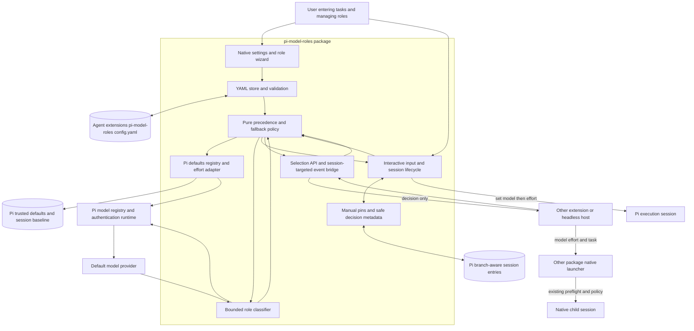

# Simple model roles for Pi — implementation plan

**Historical design record, not a current user guide.** This plan predates the implementation. Its proposed file layout, installation approach, acceptance goals, and verification statements describe that planning stage, not current support. Start with the [README](../../README.md) for GitHub installation and usage, [configuration](../configuration.md) for settings, and [compatibility](../compatibility.md) for tested behavior and known limits. The original plan below is retained for context.

> Generated 2026-09-06T06:00:56.235Z · sha256:0b0debaf311325f97942dbccb3ed6dc5e0210a1f4fb083c796aa350e4ab03c67

## Summary

Build a small, provider-agnostic Pi package with an immediately available settings menu, one inherited default role, user-defined role descriptions/model/effort, YAML persistence, bounded LLM-assisted routing, and an opt-in selection API for subagent packages. This plan incorporates the four confirmed wayfinding decisions. No implementation or dependency installation was performed.

## Outcome

An installable npm-format Pi extension that works without setup using only the default role. Users can manage roles through /model-roles; when multiple roles exist, new idle interactive prompts are classified by the resolved default model and executed with the selected role's model and effort. Manual choices remain authoritative. Other packages can request the same selection without changing the parent session, then launch their own children through their existing protocols.

## Acceptance criteria

- A fresh interactive activation with no configuration exposes /model-roles and creates exactly one role named default, with model and effort set to inherit. It introduces no provider/model dependency, no blocking onboarding wizard, and no selector request.
- The default role cannot be deleted or renamed. Users can replace its inherited model/effort and later restore inheritance. Saving changes never writes Pi's defaultProvider, defaultModel, defaultThinkingLevel, authentication, or other package settings.
- A non-default role requires a unique identifier, a nonempty natural-language description of when to use it, an exact provider/model reference, and an explicitly selected supported effort. Users can add, edit, use, and delete custom roles with cancel-safe native Pi dialogs.
- Settings persist as versioned YAML at join(getAgentDir(), 'extensions', 'pi-model-roles', 'config.yaml'), normally ~/.pi/agent/extensions/pi-model-roles/config.yaml. PI_CODING_AGENT_DIR is honored, and settings survive package replacement.
- In automatic mode, exactly one eligible role uses the direct path with zero classifier calls. With multiple eligible roles, each new idle interactive prompt causes at most one bounded classifier request to the resolved default model, never the previous task's routed model.
- Selection uses the submitted text and role descriptions, not conversation history, repository files, credentials, image bytes, or tool results. The original prompt, attachments, instructions, and tools are not rewritten by routing.
- A single valid custom-role match selects that role. No match, multiple matches, malformed output, unknown IDs, selector failure, or timeout follows a deterministic fallback policy. The policy is deterministic for fixed inputs and classifier output; semantic model judgments are explicitly not guaranteed to be reproducible.
- Role model and effort are applied before Pi's normal model/authentication preflight and pre-prompt compaction. Tool loops, retries, steering, extension wake messages, and already-queued continuations do not trigger another selection.
- Observed external model or effort changes pause automatic routing for the session. Explicit CLI startup selections and API-supplied caller selections are preserved. Resume auto-routing is an explicit action; restoring a session does not mistake the extension's own last selected model for a manual choice.
- Missing, disabled, out-of-scope, unauthenticated, or capability-incompatible role models do not prevent useful work when a permitted default, inherited baseline, or current model remains usable. The extension does not substitute a different model for an invalid explicit caller pin or replay a task after execution has begun.
- The exported selection API and versioned process-local event contract return structured decisions without switching the parent model, rewriting settings, spawning children, or altering launcher policy. Parallel requests remain isolated and cancellable.
- A tested, opt-in pi-subagents example selects first, then forwards exact model and effort through the package's existing public delegation contract. It demonstrates native child execution and explicit override preservation with fake providers and no credentials.
- A pi-subagents child that loads an ambient copy of this extension does not re-route the already-selected child, create configuration, or register a second parent routing service. Other hosts receive documented integration requirements rather than a claim of universal automatic compatibility.
- Formatter checks, lint, TypeScript checks, unit tests, SDK-backed integration tests, package-build checks, and packed-package smoke tests pass without credentials or live provider access. Narrow-terminal and cancellation behavior receive a documented manual TUI check.

## Scope

### In scope

- A new TypeScript/ESM package, initially tested against @earendil-works/pi-coding-agent 0.85.1 and Node.js >=22.19.0.
- Native /model-roles settings and session-control menus, available immediately after activation.
- One user-global YAML configuration, strict validation, safe initialization and atomic conflict-aware saves.
- Default model/effort inheritance, explicit default-role overrides, and user-authored custom roles.
- Automatic routing of new idle interactive prompts, with one classifier call at most and conservative fallback.
- Exact model identity, capability-aware effort choices, configured availability and scope checks through Pi adapters.
- Session-scoped manual pins, safe restoration, lifecycle cleanup, and compact non-sensitive decision metadata.
- A small selection library API, a session-targeted process-local event bridge, and an opt-in pi-subagents integration example.
- Credential-free tests, package validation, README/API/configuration documentation, and initial changelog.

### Out of scope

- Implementing anything during this planning run; only the HTML plan is published.
- Modifying Pi core, pi-subagents, other installed packages, or AGENTS.md.
- Transparent interception of every subagent tool, rewriting workflow scripts, monkey-patching launchers, or creating a new subagent runner.
- Automatic routing inside print, JSON, RPC, or unknown SDK hosts. These hosts use the explicit selection API in this release.
- Independent reclassification of already-queued follow-ups, steering, retries, compaction, tool-loop turns, or completion wake messages.
- External CLI/job runner model translation, distributed routing services, and cross-process event-bus transport.
- OMP configuration import, OMP's predefined roles, presets, agent personas, role execution prompts, tools, or permissions.
- Project-specific role files, configuration layering, profile generation, model pricing optimization, model benchmarks, embeddings, or custom provider discovery.
- Conversation-history classification, image classification, telemetry, persistent prompt caches, and routing log files.
- Automatic task replay or cross-provider retry after an execution model has begun work.
- Public npm publication, registry-name reservation, release credentials, and choosing a project license on the owner's behalf.

## Constraints

- Confirmed Q1: provide a documented selection API for any package and a tested pi-subagents example; the other package owns execution and policy.
- Confirmed Q2: select at a new task boundary and hold the model through its tool loop and retries; delegated tasks are selected independently.
- Confirmed Q3: manual model/effort choices pause session automation until explicitly resumed; preserve explicit startup and subagent choices.
- Confirmed Q4: automatic routing is limited to new idle interactive prompts; queued continuations keep the active role, and headless/subagent hosts integrate through the API.
- AGENTS.md requires explainable policy, provider-independent routing, typed structured metadata, safe fallback, conservative defaults, no sensitive prompt logging, and fake-provider tests.
- Role descriptions are selection criteria only. They must never be appended to the executing agent's system prompt.
- Adding a second role is the explicit configuration action that enables the additional selector-model request. The menu and documentation must disclose its cost, latency, and provider data flow.
- Do not write configuration inside node_modules, a managed git package checkout, the repository, or Pi's main settings.json.
- The extension API does not expose universal initial SDK model-choice provenance. SDK callers must supply explicit selection provenance through the public API; unknown headless sessions are not automatically routed.
- Use cached Pi registry snapshots on the routing path. Do not refresh provider catalogs, probe models, or implement authentication/discovery during classification.
- Use only public runtime APIs. Installed source inspection informs lifecycle tests, not private imports in production.

## Findings

- **This is a greenfield implementation rather than a refactor.**
  - Repository /Users/spksoft/Projects/pi-model-roles contains only AGENTS.md outside .git.
  - Inspected branch main at commit 015d86f, 'docs: add agent guidance'. git status --short was empty before publication.
  - There is no package.json, source implementation, test framework, formatter, build configuration, or changelog to preserve.
- **The installed host provides the required UI, model, effort, and inter-extension primitives.**
  - Installed @earendil-works/pi-coding-agent/package.json reports version 0.85.1 and Node.js >=22.19.0.
  - Installed docs/extensions.md documents input, model_select, thinking_level_select, session lifecycle, pi.setModel(), pi.setThinkingLevel(), pi.events, and appendEntry().
  - Installed docs/tui.md and examples/extensions/tools.ts, preset.ts, and qna.ts demonstrate native settings lists, selections, cancellable loaders, and session state.
  - Context7 library /earendil-works/pi corroborates the public extension model APIs; installed 0.85.1 declarations remain the implementation baseline.
- **Routing should happen in input, not solely in before_agent_start.**
  - Installed dist/core/agent-session.js, prompt(), lines approximately 821–950: input is emitted before model/auth checks and _checkCompaction; before_agent_start is emitted afterward.
  - The same method queues streaming follow-up/steering messages and returns before before_agent_start.
  - docs/extensions.md documents input.source and streamingBehavior, allowing interactive task input to be distinguished from extension-generated input and continuations.
- **Pi defaults and active session selections are separate and must not be conflated.**
  - docs/settings.md documents defaultProvider, defaultModel, defaultThinkingLevel, and modelThinkingLevels, plus explicit persistence using Ctrl+S.
  - docs/extensions.md states that pi.setModel() and pi.setThinkingLevel() change session history without changing configured startup defaults.
  - dist/core/settings-manager.d.ts exports read access to effective defaults and per-model thinking; dist/index.d.ts exports SettingsManager and getAgentDir.
  - docs/session-format.md documents branch-aware model/thinking entries and non-context custom extension state.
- **Model discovery, authentication, completion, and effort capability handling can stay behind Pi adapters.**
  - dist/core/model-registry.d.ts exposes getAvailable(), find(), hasConfiguredAuth(), getProvider(), and complete().
  - examples/extensions/qna.ts uses ctx.modelRegistry.complete() for an authenticated nested model request without manually reading credentials.
  - Pi AI dist/models.d.ts exports getSupportedThinkingLevels() and clampThinkingLevel().
  - docs/extensions.md documents scopedModels and warns that an empty list normally means no scope is configured; this is not a universal security-policy API.
- **YAML belongs in a writable agent extension data directory, independently of package installation.**
  - docs/environment-variables.md documents PI_CODING_AGENT_DIR and the standard ~/.pi/agent location.
  - docs/packages.md places npm packages under agent/npm and git packages under agent/git; git reconciliation resets and cleans managed checkouts.
  - docs/extensions.md recognizes agent/extensions as a stable global extension location. A data-only subdirectory without an index entry does not introduce another executable extension.
- **The settings menu must be extension-owned; a public hook for adding arbitrary rows to Pi's built-in /settings was not found.**
  - The complete public API in installed docs/extensions.md exposes registerCommand and UI components but no built-in settings-row registration API.
  - docs/tui.md Pattern 3 and examples/extensions/tools.ts show an extension command using SettingsList.
  - Q4 confirmed an immediately available /model-roles menu rather than modifying Pi's core settings implementation.
- **Subagent compatibility must be explicit and versioned, not inferred from the tool name.**
  - Installed pi-subagents/package.json reports version 0.65.1.
  - pi-subagents/docs/extension-api.md documents process-local events, structured delegation, native launch preflight, and the absence of cross-process event-bus delivery.
  - pi-subagents/docs/models.md documents precedence: per-run model overrides outrank agent-specific configuration, which outranks the inherited parent model.
  - pi-subagents/docs/agents.md states that foreground children do not load ambient parent extensions, while background children normally can.
  - pi-subagents/src/api/delegation.ts includes model and thinking on SubagentDelegationRequest.
  - pi-subagents/src/runs/shared/child-runtime-config.ts defines the PI_SUBAGENT_CHILD marker; capture child identity at extension initialization rather than reading temporarily changed process state during parent callbacks.
- **Semantic routing is an intentional exception to an otherwise deterministic, local policy.**
  - The user explicitly requested that the default model select a role from task descriptions.
  - AGENTS.md prefers deterministic routing and avoids network calls unless explicitly configured.
  - The confirmed destination reconciles these by using local precedence/validation/fallback, zero classifier calls with only default, and one disclosed bounded request after additional roles are configured.

## Architecture design

Use four boundaries: declarative configuration and pure policy; a small Pi model/defaults adapter; interactive lifecycle/UI integration; and a non-mutating public selection service. No provider-specific model names or agent names belong in core policy.

Configuration contract (version 1):
version: 1
enabled: true
selectorTimeoutMs: 8000
roles:
  default:
    model: inherit
    effort: inherit

A custom role adds, for example:
  fast:
    description: >-
      Use for tasks with clear, complete instructions and straightforward execution.
    model:
      provider: example-provider
      id: example-model
    effort: low

The example identifiers are placeholders, not installed defaults. model is either inherit for default or an exact {provider, id} object; custom roles require the object. Model IDs may contain slashes. effort is inherit only for default, otherwise one of Pi's supported off/minimal/low/medium/high/xhigh/max values. enabled defaults to true and disables automatic package selection when false, without removing menus or explicit manual actions. selectorTimeoutMs defaults to 8000 and accepts 1000–60000. Unknown fields and unsupported versions are rejected without overwriting the file. There are no implicit custom roles, provider URLs, credentials, executable values, or per-project overrides.

Bounded inputs: at most 32 roles including default; identifiers match [a-z][a-z0-9_-]{0,47}; custom descriptions are 1–2000 Unicode characters after trimming; model provider/id fields are nonempty bounded strings; YAML is capped at 256 KiB. Reject duplicate keys, custom tags, aliases/merge expansion, non-string descriptions, and reserved/prototype-related keys. Present default first and other IDs in lexical order. Menu saves use canonical YAML; document that comments/formatting may be normalized.

Inheritance: retain inherit symbolically in YAML. Resolve Pi's effective configured provider/model through read-only, trust-aware settings access and the active registry. Resolve effort from Pi's per-model default, then its global default, then the unmodified startup baseline. If Pi has no valid configured default, use the model/effort that Pi already resolved at session startup. Never redefine this baseline from an automatic role switch. Re-resolve on extension/config reload; custom default-role values override the inherited values only inside this package. Explicit user/session pins take precedence over applying default.

Selection contract: selectModelForTask(request, dependencies) receives the task text, current and inherited baseline references, allowed/available model snapshot, optional explicit caller model/effort or requested role, and AbortSignal. It returns a discriminated decision with status selected/preserved/unavailable/cancelled; optional role and exact model; requested/effective effort; fallback flag; a stable reason code; safe warning codes; and optional selector duration/usage. It never mutates a Pi session or launches an agent. A caller-supplied allowed-model set distinguishes absent restrictions from an explicitly empty set; launcher policy remains authoritative.

Precedence: explicit model/effort pin or manual session pause → explicit requested role → disabled-automation pass-through → direct default when no eligible custom role remains → classifier. For explicit effort alone, preserve the caller's current model rather than silently choosing another role. Invalid explicit pins return unavailable for caller-owned handling; they are not replaced. Normal role failures fall back in order to the configured default role, inherited Pi baseline, then the current permitted usable model, deduplicated by exact identity. If none is usable, return unavailable and allow Pi/the caller to report its normal actionable error. Do not choose an arbitrary new provider.

Classifier: call the resolved default model through ctx.modelRegistry.complete(), with a standalone no-tools context containing the bounded submitted text and custom-role IDs/descriptions. Do not change the active session just to make this request. Ask for strict JSON {matches: string[]} containing only clearly matching configured IDs. One unique valid match selects it; zero or multiple unique matches select default. Reject unknown IDs, duplicate IDs, extra fields, malformed JSON, unexpected tool output, incomplete/errored responses, and oversized output. Sort role inputs deterministically; do not rely on model prose as a reason or claim temperature can guarantee determinism. Keep common request options small and supported: deadline signal, bounded output budget of 2048 tokens, and no speculative provider-specific reasoning or temperature fields. Role effort governs task execution, not a second configurable selector-effort profile. Tasks exceeding 16384 Unicode characters or the conservative selector context budget bypass classification with an explicit reason rather than being silently truncated. Images contribute capability metadata only; image-only/insufficient text safely uses default.

Lifecycle: register /model-roles during extension setup. On a primary interactive session start, load/initialize YAML and capture baseline, child identity, and saved manual state; perform no model request and no automatic startup model switch. On input, route only mode=tui, source=interactive, and a new idle non-streaming task. This precedes Pi's authentication and pre-prompt compaction. Other events, raw slash commands that will expand later, extension wake messages, and queued continuations are either bypassed or conservatively use the default without expansion-specific guessing; normal slash command handling remains Pi-owned. Keep the selected model after the task so the footer shows reality, but always use the independent default baseline for the next selector. Let Pi own conversation conversion and compaction.

Switch transaction: snapshot model/effort and session generation; select and revalidate the result; apply model before effort; read back actual clamped effort; emit metadata only after the outcome is known. An internal change guard distinguishes extension-authored notifications from external changes, with expected-value checks and generation invalidation rather than a blanket suppression flag. If an external change, shutdown, reload, or navigation happens while selection is pending, discard the stale decision. Selection timeout falls back; explicit cancellation aborts selection. In TUI, Escape during the selection loader cancels the pending submission, restores its text, and does not execute the task; communicate any attachment re-entry limitation rather than persisting images. Do not reroute or replay after task execution begins.

Persistence: role configuration is the YAML file only. Save with a bounded process-local queue plus an exclusive filesystem lock, re-read-and-compare revision, same-directory private temporary file, fsync where supported, and atomic rename. No automatic stale-lock takeover; show recovery instructions after a bounded timeout. Malformed existing files are retained. A last-known-good in-memory snapshot may continue; on cold invalid configuration, preserve Pi's active model and expose repair controls. Manual pause/role state and safe decision entries may use Pi's existing branch-aware custom JSONL entries; task text, descriptions, raw classifier responses, and credentials never enter those entries.

Interoperability: export the pure service/types from the compiled package root. Also expose pi-model-roles:select:v1 on pi.events for independently installed packages that are not Node dependencies. A validated request targets one exact session and synchronously receives a result Promise, which the caller awaits; no listener/result means unavailable. This is process-local and request-scoped, not a global model singleton. Child/unknown headless runtimes do not automatically register a main-session router. A pi-subagents example uses the existing structured delegation request with model and thinking, a fresh native demonstration agent with known model provenance, and the package-owned execution path. Real consumers must resolve their own explicit agent/run pins before requesting auto-selection. Detect known pi-subagents children at initialization and disable ambient auto-routing so background children are not selected twice.

Package structure: src/config, src/core, src/pi, and src/ui feed src/extension.ts; src/index.ts exposes only the selection library. Build ESM and declarations into dist; package.json pi.extensions points to dist/extension.js and exports points to dist/index.js. The release tarball is prebuilt, with no install-time build or postinstall side effects. Pi host packages are peers, with exact tested development versions; yaml is the only planned third-party runtime dependency.

## Implementation tasks

### T1 — Establish package foundations and typed contracts

**What:** Create the minimal TypeScript/ESM package, quality commands, and versioned domain contracts without embedding a routing implementation in the extension entry point.

**Why:** The repository has no code or tooling. A small explicit contract prevents UI, provider behavior, and third-party launch semantics from becoming intertwined.

**How:** Use a prebuilt dist extension entry and library export; add strict TypeScript, Node's test runner through tsx, and Biome for formatting/lint. Pin development host versions to inspected Pi 0.85.1 while following Pi's peer-dependency packaging guidance. Define one inherited default, configuration limits, decision unions, dependency interfaces, and stable reason codes.

**Files/modules:** package.json, package-lock.json, tsconfig.json, tsconfig.build.json, biome.json, .gitignore, src/index.ts, src/extension.ts, src/core/types.ts, src/core/defaults.ts, test/support/

**Depends on:** None

**Validation:**

- npm run typecheck succeeds with strict settings.
- A minimal node:test case runs through npm test without credentials.
- Build output exposes separate extension and selection-library entry points.
- No AGENTS.md changes or hardcoded live model defaults are introduced.

#### Subtasks

##### T1.1 — Create reproducible build and quality commands

**What:** Add package metadata, build configuration, development dependencies, and documented scripts.

**Why:** The package must install without devDependencies or lifecycle builds, and the project currently has no validation commands.

**How:** Set type=module and engines.node >=22.19.0; compile declarations and ESM into dist. Add build, typecheck, test, test:integration, format:check, lint, and check scripts. Use yaml as a runtime dependency, Pi packages as unbundled peers, and exact development versions for host integration tests. Whitelist release files so docs/plan, test fixtures, local YAML, and secrets are not packed.

**Files/modules:** package.json, package-lock.json, tsconfig.json, tsconfig.build.json, biome.json, .gitignore

**Depends on:** T1

**Validation:**

- Inspect the package manifest for zero install/postinstall scripts.
- Run the formatter/linter on the initial scaffold.
- Build once and verify dist contains declarations and resolvable ESM imports.

##### T1.2 — Define configuration and selection domain types

**What:** Define version-1 role data, exact model references, effort semantics, request/decision unions, and adapter interfaces.

**Why:** Consumers need a stable small API and policy needs deterministic inputs independent of Pi UI or provider objects.

**How:** Implement plain serializable model references; a reserved default role with inheritance; explicit custom-role description/model/effort; selected/preserved/unavailable/cancelled decisions; safe reason/warning enums; and injected registry, defaults, classifier, clock, and cancellation dependencies. Centralize limits and default values, including the 8000 ms selector timeout.

**Files/modules:** src/core/types.ts, src/core/defaults.ts, src/config/types.ts, test/unit/contracts.test.ts

**Depends on:** T1.1

**Validation:**

- Compile negative type fixtures for invalid effort, model reference, and decision variants.
- Assert the default factory returns only default and never shares mutable objects.
- Test that decision serialization contains no prompt, description, credential, or provider response field.

##### T1.3 — Build fake host and provider test seams

**What:** Create reusable fake registries, completion responders, clocks, event buses, UIs, and model-switch recorders.

**Why:** All routing and launch tests must be reproducible and must not need accounts, credentials, or network access.

**How:** Provide deterministic responses, delayed/aborted requests, authentication absence, model capability changes, session generations, and simulated event order. Include fixtures for exact provider/model IDs with embedded slashes, unsupported efforts, and scope restrictions. Prepare an SDK-backed fake-provider harness distinct from lightweight unit mocks.

**Files/modules:** test/support/fake-registry.ts, test/support/fake-pi.ts, test/support/fake-ui.ts, test/support/fake-provider.ts, test/support/fixtures.ts

**Depends on:** T1.2

**Validation:**

- Prove the fake transport rejects unplanned outbound requests.
- Assert fake calls record model identity and options without writing task text to reports.
- Run independent simultaneous fake requests and verify no state bleed.

### T2 — Implement strict YAML storage and safe configuration lifecycle

**What:** Implement role YAML parsing, load-time validation, initialization, transactional writes, conflict detection, and reload behavior.

**Why:** User-authored configuration is the package's durable contract and must survive updates, invalid edits, crashes, and multiple Pi sessions.

**How:** Resolve the fixed data path via getAgentDir. Separate structural validation from registry availability diagnostics. Initialize only absent configuration in a primary interactive session. Retain invalid files, keep last-known-good snapshots, and save complete validated drafts atomically under a bounded exclusive lock.

**Files/modules:** src/config/schema.ts, src/config/codec.ts, src/config/paths.ts, src/config/store.ts, src/config/snapshot.ts, test/unit/config.test.ts, test/integration/config-store.test.ts

**Depends on:** T1

**Validation:**

- Round-trip the one-role and custom-role examples, preserving multiline descriptions and exact identities.
- Test malformed YAML, duplicate keys, unknown version/fields, aliases, oversized files, and invalid role values.
- Test read-only paths, interrupted writes, competing saves, and stale-lock recovery behavior.
- Verify initial load never replaces an existing malformed file.

#### Subtasks

##### T2.1 — Validate and serialize the version-1 schema

**What:** Implement a safe YAML codec and actionable field-level validation.

**Why:** Malformed or executable-looking configuration must not enter routing or produce sensitive error output.

**How:** Parse a bounded YAML document with core scalar semantics and no custom tags or alias/merge expansion. Reject duplicate and unknown keys, invalid inheritance, missing default, invalid IDs, empty descriptions, invalid efforts, and non-object model references. Use line/column and field-path diagnostics without echoing source snippets. Serialize default first and remaining roles in stable ID order.

**Files/modules:** src/config/schema.ts, src/config/codec.ts, test/unit/config.test.ts

**Depends on:** T1.2, T1.3

**Validation:**

- Table-test all schema fields and limits, including Unicode descriptions and quoted off values.
- Verify duplicate default/custom keys cannot silently overwrite one another.
- Assert YAML errors do not include credential-like fixture values or descriptions.

##### T2.2 — Persist YAML atomically with conflict protection

**What:** Implement secure path resolution, missing-file initialization, locking, revision checks, and atomic replacement.

**Why:** Atomic rename prevents partial files; revision checks and locking prevent one session from silently overwriting another user's settings.

**How:** Use join(getAgentDir(), 'extensions', 'pi-model-roles', 'config.yaml'). Reject non-regular final files and unsafe config-file symlinks. Create private temporary files in the same directory, write and sync them, then rename. Acquire a bounded exclusive filesystem lock before re-reading the current revision and writing; serialize same-process saves. Return conflict/busy results for retry in UI, clean up in finally, and never automatically steal an abandoned lock.

**Files/modules:** src/config/paths.ts, src/config/store.ts, test/integration/config-store.test.ts

**Depends on:** T2.1

**Validation:**

- Run two-process save tests and confirm stale drafts are rejected rather than lost.
- Inject failures before write, before rename, and after rename; the final file is always old-valid or new-valid.
- Verify custom PI_CODING_AGENT_DIR and directories with spaces.
- Check restrictive new-file permissions where supported and bounded failure on read-only storage.

##### T2.3 — Manage immutable snapshots and reload errors

**What:** Publish validated immutable snapshots and a clear reload/repair lifecycle.

**Why:** Menus and routing must not observe half-edited roles or silently rewrite corrupt settings.

**How:** Load on session_start, /reload, and explicit /model-roles reload. A successful menu save updates the current snapshot immediately and invalidates pending decisions. Other running sessions pick up changes on reload; avoid background watchers and per-prompt file I/O. Distinguish first-run absence, cold invalid configuration, last-known-good fallback, and availability warnings. Require confirmation for reset and preserve an invalid file until the user explicitly chooses replacement.

**Files/modules:** src/config/snapshot.ts, src/config/store.ts, test/unit/config-snapshot.test.ts

**Depends on:** T2.2

**Validation:**

- Verify a failed reload retains the last valid snapshot but does not mark the file valid.
- Verify a cold invalid load preserves Pi's active model and leaves repair menus available.
- Assert no model request or catalog refresh occurs during load, save, or reload.

### T3 — Adapt Pi defaults, model capabilities, and classifier transport

**What:** Build the host-facing adapters for inheritance, availability, effort normalization, and bounded authenticated completion.

**Why:** Provider specifics and Pi version-sensitive behavior must remain outside pure role policy.

**How:** Read effective trusted defaults without saving them; use the live registry's cached exact references and capability helpers; invoke the default classifier through ModelRegistry.complete. Expose only normalized data to core policy and protect the complete request with a deadline including authentication/setup time.

**Files/modules:** src/pi/defaults.ts, src/pi/registry.ts, src/pi/classifier.ts, src/pi/startup-choice.ts, test/unit/pi-adapters.test.ts, test/integration/pi-model-runtime.test.ts

**Depends on:** T1, T2

**Validation:**

- Verify inheritance does not drift after an automatic model switch.
- Verify custom-provider fake completion follows Pi's configured runtime rather than a separately constructed credential client.
- Test supported effort lists, scope filters, missing models, and auth absence.
- Ensure no routing-path registry refresh or live probe occurs.

#### Subtasks

##### T3.1 — Resolve inherited defaults and explicit startup choices

**What:** Implement stable default inheritance and conservative CLI choice provenance.

**Why:** The selector must always use default, not the last routed worker; explicit startup model/effort choices must not be overridden.

**How:** Use public SettingsManager read APIs with project trust explicitly respected, plus the pre-routing startup model/effort as a fallback. Resolve per-model thinking before global/default fallback. Detect documented CLI --model/--provider/--thinking options with a narrow tested argv adapter that respects the end-of-options boundary and never scans prompt text for flags. Unknown SDK/headless origins remain outside automatic routing and must provide explicit provenance to the API.

**Files/modules:** src/pi/defaults.ts, src/pi/startup-choice.ts, test/unit/defaults.test.ts, test/unit/startup-choice.test.ts

**Depends on:** T1.2, T1.3, T2.3

**Validation:**

- Test saved defaults, unset defaults, invalid saved defaults, trusted/untrusted project defaults, and custom agent directories.
- Route to fast, reload, and assert default still resolves to Pi's saved baseline or the retained original baseline.
- Test actual CLI option forms and prompt strings containing '--model' without creating false pins.
- Assert no Pi settings setter or flush/write path is invoked.

##### T3.2 — Normalize eligible models and effort capabilities

**What:** Create exact model lookup, capability checks, and safe effort mapping.

**Why:** Model names can collide across providers, and role effort may become unsupported when catalogs change.

**How:** Use provider plus complete model ID as identity; do not fuzzy-match or split model IDs repeatedly on slash. Combine cached availability with nonempty Pi scopedModels and any explicit caller allowlist. For API restrictions, an explicit empty allowlist means no models. Exclude unavailable/incompatible role candidates and expose field-level warnings. Use Pi's supported-effort and clamp helpers for role settings; report requested versus effective effort. Do not reinterpret invalid explicit caller pins.

**Files/modules:** src/pi/registry.ts, src/core/model-identity.ts, test/unit/registry.test.ts

**Depends on:** T1.2, T1.3

**Validation:**

- Test duplicate bare IDs across providers, IDs containing slashes, unavailable providers, and changing capability maps.
- Test off-only models and each supported effort level.
- Test explicit empty restrictions, ordinary unscoped Pi sessions, and stricter caller-owned restrictions.
- Verify attachment/history capability metadata can prevent an unsafe switch without sending image content to the classifier.

##### T3.3 — Add a deadline-bounded classifier transport

**What:** Implement the small no-tools completion gateway using Pi's configured model runtime.

**Why:** Direct runtime completion preserves custom providers/authentication while avoiding recursive agent turns and secret handling.

**How:** Call ctx.modelRegistry.complete with a standalone system prompt and bounded user data, no tools, a 2048-token output cap, and a composed deadline/request signal. Do not set the active model, manually read auth files, add speculative temperature/reasoning fields, or retry. Bound the entire operation with a timeout race and ignore late completion even if a provider fails to cooperate with AbortSignal. Return sanitized transport status, text for in-memory parsing, and numeric usage/duration only.

**Files/modules:** src/pi/classifier.ts, test/unit/classifier-transport.test.ts, test/integration/pi-model-runtime.test.ts

**Depends on:** T3.1, T3.2

**Validation:**

- Assert exactly one request goes to the default model even while the session is on another role.
- Simulate timeout during authentication, provider hang, aborted/errored completion, and late success; no stale result is applied.
- Exercise built-in-style and dynamically registered fake providers through real Pi APIs.
- Verify the request has no execution tools, conversation history, or credentials in diagnostics.

### T4 — Implement deterministic role policy around semantic classification

**What:** Implement the standalone selection pipeline, strict classifier protocol, conservative fallback, and non-sensitive metadata.

**Why:** Model judgment should decide only matching; explicit choices, error behavior, and final executable model resolution must be predictable.

**How:** Resolve explicit pins and manual requests before auto-selection. Skip classification for disabled automation or no eligible custom roles. Ask the default model for matching role IDs, validate the complete response, and choose a custom role only when one unambiguous valid match remains. Use a finite deduplicated fallback chain and return structured results.

**Files/modules:** src/core/select.ts, src/core/classifier-protocol.ts, src/core/fallback.ts, src/core/decision.ts, test/unit/selection.test.ts, test/unit/classifier-protocol.test.ts

**Depends on:** T1, T2, T3

**Validation:**

- Table-test normal selection, default-only routing, explicit pins, disabled routing, unavailable roles, and every fallback branch.
- Assert one classifier call at most and zero calls on deterministic bypass paths.
- Test strict JSON handling and deterministic ambiguity behavior.
- Run cancellation and concurrent-request tests without shared session mutations.

#### Subtasks

##### T4.1 — Encode precedence and finite fallback policy

**What:** Implement the ordered local decision rules and deduplicated fallback resolution.

**Why:** Caller authority and safe progress cannot depend on classifier prose or incidental registry ordering.

**How:** Return explicit caller choices unchanged when valid; reject rather than replace invalid explicit pins. Resolve explicit requested roles without classification. Otherwise honor enabled=false, then the direct default path, then classification. Revalidate normal role results and fall back to configured default, inherited baseline, and current permitted usable model in that order. No usable option returns unavailable. Effort-only pins retain the caller's current model.

**Files/modules:** src/core/select.ts, src/core/fallback.ts, test/unit/selection.test.ts

**Depends on:** T1.2, T2.3, T3.2

**Validation:**

- Use a precedence table covering every pair of conflicting inputs.
- Assert invalid explicit models never silently change providers.
- Test default/role/current identities that are equal to prove termination and no repeated attempts.
- Test disappearance of a selected model between classification and final validation.

##### T4.2 — Constrain classifier inputs and outputs

**What:** Implement role-description prompt assembly and strict response validation.

**Why:** Task text and role descriptions can contain instructions; the classifier must remain a bounded selector, not an executor or arbitrary model resolver.

**How:** Encode task and descriptions as clearly delimited data, list only eligible configured role IDs, and instruct the model to identify clear matches without obeying task instructions. Parse only complete JSON with the exact matches array schema. One unique valid custom ID selects it; zero or multiple unique valid IDs use default. Reject duplicate/unknown IDs, code fences, extra fields, unbounded content, tool calls, and malformed responses. Bypass oversized, image-only, or insufficient-context inputs with stable reasons rather than truncation.

**Files/modules:** src/core/classifier-protocol.ts, src/core/select.ts, test/unit/classifier-protocol.test.ts, test/fixtures/classifier/

**Depends on:** T4.1, T3.3

**Validation:**

- Test no match, one match, overlapping descriptions, reordered role maps, duplicate IDs, unknown IDs, and extra keys.
- Use synthetic prompt-injection fixtures requesting secrets, arbitrary models, or tools; only allowlisted role selection or fallback is possible.
- Assert role descriptions never appear in execution-system-prompt mutations.
- Test text/context/output limits exactly at and above their boundaries.

##### T4.3 — Return isolated decisions and safe observability data

**What:** Finalize request cancellation, immutable results, reason codes, and usage metadata.

**Why:** Subagent callers may select many tasks simultaneously and need explanations without exposing task contents.

**How:** Keep all request state local, including deadline, candidate snapshot, parsed output, and fallback status. Drop temporary task/response references after completion; do not add a persistent classification cache. Return numeric selector usage/duration separately from execution usage. Expose stable code-based reasons rather than model explanations or raw exceptions.

**Files/modules:** src/core/decision.ts, src/core/select.ts, test/unit/selection-concurrency.test.ts, test/unit/privacy.test.ts

**Depends on:** T4.2

**Validation:**

- Run simultaneous requests with different defaults, allowlists, roles, and signals; cancel one without affecting another.
- Inject credential-like/task sentinel strings and assert they do not appear in decisions or diagnostics.
- Verify no selector call changes the fake parent's model, effort, tools, messages, or settings.
- Assert selector usage is not mislabeled as worker-model usage.

### T5 — Integrate interactive task routing and session authority

**What:** Connect selection to Pi's input lifecycle, safely apply model/effort, and preserve manual choices across reload/navigation.

**Why:** The main session needs automatic switching without recursive prompts, stale asynchronous decisions, or interference with the user's model controls.

**How:** Use an interactive-only input adapter, generation-scoped operations, transactional application, and branch-aware session state. Skip known children and noninteractive hosts. Distinguish extension-authored model/effort notifications from external changes and pause on external changes.

**Files/modules:** src/extension.ts, src/pi/lifecycle.ts, src/pi/apply.ts, src/pi/session-state.ts, src/pi/status.ts, test/integration/lifecycle.test.ts, test/integration/session-state.test.ts

**Depends on:** T2, T3, T4

**Validation:**

- Verify selected model/effort are effective before Pi's first execution request and pre-prompt compaction.
- Assert zero reclassification during tool loops, retries, queued continuations, or extension wakeups.
- Test manual choices, reload/resume/fork/tree navigation, config changes, and shutdown during pending classification.
- Verify no automatic routing or config bootstrap occurs in known child/headless contexts.

#### Subtasks

##### T5.1 — Route only eligible new interactive submissions

**What:** Register lifecycle hooks and implement the exact task-boundary gate.

**Why:** The user confirmed an idle-interactive boundary; broader hook usage would add cost and unexpectedly switch active work.

**How:** Capture known child identity once at factory initialization. Register the command immediately, then load state during primary interactive session_start. In input, require mode=tui, source=interactive, no streamingBehavior, and an idle primary session. Bypass extension commands, raw expansion commands, steering, queued continuations, and other modes without modifying the prompt. Guard pending routing with an extension-owned busy token and session/config generation. Use a native cancellable loader; cancel returns handled without executing the submission, while timeout follows fallback.

**Files/modules:** src/extension.ts, src/pi/lifecycle.ts, src/ui/selection-loader.ts, test/integration/lifecycle.test.ts

**Depends on:** T2.3, T3.1, T4.3

**Validation:**

- Drive actual Pi input event ordering with a fake provider and check that routing precedes execution preflight.
- Assert input text and images remain unchanged on success/fallback.
- Test cancellation restores text, prevents execution, and does not persist attachment content.
- Test rapid submissions, input handled by another extension, and raw slash commands without recursive dispatch.

##### T5.2 — Apply model and effort without stale state

**What:** Implement model-first switching, capability readback, failure recovery, and internal-event attribution.

**Why:** Pi may clamp effort during model changes; a late selector or broad event-suppression guard could overwrite a user's newer choice.

**How:** Revalidate candidates immediately before application; snapshot the previous pair and expected generation. Avoid redundant setModel calls. Apply model, then role effort, and read back the effective pair. Track expected notifications while still recognizing mismatched external changes. On a normal pre-execution switch failure, try the finite fallback chain or restore the prior usable pair; do not apply the failed role's effort to a different model. Recheck generation after awaits and never replay execution.

**Files/modules:** src/pi/apply.ts, src/pi/lifecycle.ts, test/integration/model-application.test.ts

**Depends on:** T5.1, T3.2, T4.1

**Validation:**

- Simulate setModel false/throw, effort clamping, model removal, and effort setter failure.
- Change the model manually while classification or authentication awaits; the stale role must never win.
- Assert failed role effort is not left on the fallback/current model.
- Test cross-provider history and smaller-context switches through Pi's normal conversion/compaction path using synthetic histories.

##### T5.3 — Persist manual pins and display safe routing status

**What:** Implement session auto/manual state, branch restoration, and compact status/decision entries.

**Why:** Manual choices must survive reload and resumption without freezing an automatically selected model by mistake.

**How:** Persist only versioned baseline references, mode, optional manually requested role, and safe decision metadata in Pi custom entries. Restore from the active branch, not all session entries; detect subsequent external model/effort changes conservatively. New sessions start fresh; resume/fork/tree navigation rehydrate the relevant branch and invalidate pending work. Show role, actual model/effort, paused status, fallback code, and selector usage on demand. Abort work and dispose listeners/loaders on shutdown.

**Files/modules:** src/pi/session-state.ts, src/pi/status.ts, src/pi/lifecycle.ts, test/integration/session-state.test.ts, test/unit/privacy.test.ts

**Depends on:** T5.2

**Validation:**

- Test automatic fast selection followed by reload does not become a manual pin.
- Test manual model and effort changes pause until explicit resume, including after branch navigation.
- Test unsupported/restored custom-entry versions safely preserve the actual Pi session.
- Search captured entries/status/errors for task and credential sentinels.
- Assert no leaked listeners, unresolved pending requests, or status rows after shutdown.

### T6 — Build the native settings and role-management experience

**What:** Expose role CRUD, default inheritance controls, explicit role use, pause/resume, reload, and status through /model-roles.

**Why:** Users should not need to author YAML, learn provider IDs, or install a separate UI to configure a simple role.

**How:** Use Pi's built-in selection/input/editor/confirmation components. Keep editing in a draft until a complete validated save; show the current configuration path and resolved inherited values. Explain routing activation and provider data flow before saving the first additional role.

**Files/modules:** src/ui/menu.ts, src/ui/role-editor.ts, src/ui/model-picker.ts, src/ui/effort-picker.ts, src/ui/commands.ts, test/unit/ui-flow.test.ts, test/integration/settings-flow.test.ts

**Depends on:** T2, T3, T5

**Validation:**

- Complete add/edit/delete/use/reset flows with a fake UI and verify exact persisted YAML.
- Cancel at every wizard step and confirm no partial configuration or model change.
- Verify default cannot be removed and custom roles require description/model/effort.
- Manually check keyboard-only operation, long provider names, multiline/non-English descriptions, and narrow terminals.

#### Subtasks

##### T6.1 — Expose discoverable role and routing menus

**What:** Implement the immediately available main menu and status view.

**Why:** The default-only installation must be useful and understandable without a forced onboarding wizard.

**How:** Register /model-roles with completions for settings, status, reload, pause, auto, and use <role>. Display default first, resolved inherited model/effort, custom-role summaries, global enabled state, session manual state, availability warnings, and configuration path. Reuse Pi theme/keybinding behavior and standard dialogs; do not override built-in /settings, editor, footer, or unrelated statuses.

**Files/modules:** src/ui/menu.ts, src/ui/commands.ts, src/pi/status.ts, test/unit/ui-flow.test.ts

**Depends on:** T2.3, T3.2, T5.3

**Validation:**

- Assert menu registration occurs even without config or credentials.
- Verify the initial menu contains exactly the default role and an Add role action.
- Test noninteractive invocation returns actionable guidance without blocking UI or corrupting stdout protocol.

##### T6.2 — Implement transactional role-editing dialogs

**What:** Build default/custom role editing with native model and effort pickers.

**Why:** A role must not become active with an empty description, missing model, or forgotten effort.

**How:** For new roles, collect ID, multiline selection description, exact model from the cached eligible registry, then an explicit effort from supported levels. For default, offer inherit choices and show their resolved values. Changing a model refreshes effort choices and requires a valid draft. Preserve unavailable existing selections visibly but prevent saving a newly invalid assignment. Show a review screen and save atomically only after confirmation; conflicts offer reload-and-reapply rather than forced overwrite.

**Files/modules:** src/ui/role-editor.ts, src/ui/model-picker.ts, src/ui/effort-picker.ts, test/unit/role-editor.test.ts, test/integration/settings-flow.test.ts

**Depends on:** T6.1, T2.2

**Validation:**

- Test blank/duplicate/reserved IDs, empty descriptions, no available models, off-only models, and all cancellation points.
- Verify changing default in the menu does not alter Pi's settings file.
- Verify the first additional-role save explains the extra selector call and that the selected execution provider receives the normal conversation.
- Test a concurrent external YAML edit produces a conflict without data loss.

##### T6.3 — Add explicit session controls and recovery actions

**What:** Complete pause/resume, manual role use, reload, delete, and reset semantics.

**Why:** Users need a clear way to recover from wrong routing or malformed configuration and to regain manual authority.

**How:** Pause keeps the actual active model/effort and records session state. Auto clears the manual pause for the next eligible prompt; it does not launch a classifier immediately. Use role resolves and applies it without semantic classification and pauses automation. Delete requires confirmation and cannot target default. Disabling automatic behavior preserves Pi's current model. Reset requires an explicit destructive confirmation and restores only the package's one-default YAML; it does not touch Pi or other packages. Explain stale-lock and invalid-file recovery with bounded safe diagnostics.

**Files/modules:** src/ui/commands.ts, src/ui/menu.ts, src/config/store.ts, src/pi/session-state.ts, test/integration/settings-controls.test.ts

**Depends on:** T6.2, T5.3

**Validation:**

- Test pause/use/auto precedence over multi-role configuration and restoration.
- Verify deleting the last custom role returns to zero-selector behavior.
- Verify reset affects only the configured package YAML after confirmation.
- Test lock-busy, invalid YAML, and unavailable role errors leave the agent usable.

### T7 — Publish the selection API and verified subagent example

**What:** Expose the core selector to other packages and demonstrate a safe native pi-subagents handoff.

**Why:** The confirmed compatibility goal is reusable selection, not fragile interception or ownership of another package's execution.

**How:** Export a typed library service and an explicitly session-targeted process-local event request. Keep results model-only and non-mutating. Include opt-in examples that resolve caller authority before selection and pass exact model/effort to an existing launcher. Verify the current pi-subagents contract with a fake provider.

**Files/modules:** src/index.ts, src/api/select.ts, src/api/events.ts, src/api/types.ts, examples/selection-client.ts, examples/pi-subagents.ts, test/integration/api.test.ts, test/integration/pi-subagents.test.ts

**Depends on:** T3, T4, T5

**Validation:**

- Import the packed library from a separate consumer fixture.
- Request different child models concurrently and assert the parent never changes.
- Exercise the process-local event request with correct/wrong sessions, cancellation, missing listeners, and reload.
- Verify model and thinking reach the pi-subagents native child through the public contract without modifying launcher policy.

#### Subtasks

##### T7.1 — Expose a small side-effect-free selection library

**What:** Export selectModelForTask, request/decision types, and dependency interfaces from the package root.

**Why:** SDK and headless consumers need routing without UI registration, filesystem writes, or hidden session mutation.

**How:** Keep src/index.ts free of extension-factory side effects. Require callers to provide task, current/baseline model information, availability/restrictions, and explicit model/effort provenance. Return decisions only. Document that callers retain ownership of fallback for invalid explicit pins, selected-model application, child context, policy checks, and launcher cancellation. The API never discovers an agent or invokes a subagent tool.

**Files/modules:** src/index.ts, src/api/select.ts, src/api/types.ts, examples/selection-client.ts, test/integration/api.test.ts

**Depends on:** T4.3, T3.2

**Validation:**

- Importing the API performs no I/O or extension registration.
- Verify explicit agent/run choices skip classification and remain exact.
- Verify an effort-only pin retains the current caller model.
- Test parallel requests with independent model scopes and cancellation.

##### T7.2 — Add a session-targeted event bridge

**What:** Support independently installed Pi packages through pi-model-roles:select:v1.

**Why:** Separately installed Pi packages are not automatically Node dependencies, and a module-global singleton would cross session boundaries.

**How:** Define a versioned in-process request with target session ID, typed selection input, optional AbortSignal, and a result Promise slot assigned synchronously by the matching listener. Validate bounds and target identity before accepting; first compatible owner wins. No handler means unavailable and must not spawn work. Keep per-request state isolated, abort on session teardown, remove listeners on reload, and document that promises/signals do not form a cross-process transport.

**Files/modules:** src/api/events.ts, src/api/types.ts, src/extension.ts, test/integration/event-api.test.ts

**Depends on:** T7.1, T5.3

**Validation:**

- Load two fake session instances on one bus and verify only the targeted instance handles a request.
- Test absent listener, unsupported version, malformed input, duplicate listener, teardown, and cancellation.
- Assert events return no raw prompt in result metadata and never call setModel on the parent.
- Verify all returned promises settle or cancel after shutdown.

##### T7.3 — Demonstrate native pi-subagents delegation without interception

**What:** Add an opt-in example and integration test that select before using pi-subagents' public launch contract.

**Why:** A tested example proves compatibility while avoiding claims about uninstrumented workflows or external runners.

**How:** Keep the example outside pi.extensions so installation does not register a new agent/tool automatically. For a self-contained demonstration, register a uniquely named model-unpinned native example agent through the documented runtime-registration event, then request role selection and send the existing structured delegation request with exact model and thinking. Use fresh context and package-owned preflight/policy. Dispose registrations on cleanup. Include an explicit-pin path and explain that real consumers must resolve frontmatter/provider/run precedence before selecting. Test against pi-subagents 0.65.1 through an isolated SDK fixture and fake provider, with no private imports in production. Verify ambient child copies stay inactive.

**Files/modules:** examples/pi-subagents.ts, test/integration/pi-subagents.test.ts, test/support/subagents-harness.ts, package.json

**Depends on:** T7.2, T5.1

**Validation:**

- Assert native child first request uses the selected model/effort and parent state is unchanged.
- Assert explicit child model/effort results in zero classifier calls.
- Verify missing/incompatible pi-subagents returns actionable unsupported status rather than launching by another mode.
- Test known-child ambient loading produces zero extra classifier calls, bootstrap writes, or duplicate services.
- Verify launcher denial and terminal failure remain authoritative; no policy bypass, task replay, or fallback launcher is attempted.

### T8 — Complete end-to-end validation, documentation, and release packaging

**What:** Close the complete user journey with credential-free integration tests, accurate documentation, and a production-style tarball smoke test.

**Why:** The package's value depends on installation, settings, model switching, and interoperability working together, not just isolated classifier tests.

**How:** Run synthetic end-to-end scenarios through real Pi APIs where possible, cover the confirmed scope boundary explicitly, document all defaults/limits/reasons, and inspect an isolated packed installation without devDependencies. Record compatibility evidence and residual limitations without live-provider claims.

**Files/modules:** test/integration/end-to-end.test.ts, test/integration/package-smoke.test.ts, test/manual/tui-checklist.md, README.md, docs/configuration.md, docs/api.md, docs/compatibility.md, CHANGELOG.md, .github/workflows/ci.yml, package.json

**Depends on:** T1, T2, T3, T4, T5, T6, T7

**Validation:**

- Run npm run format:check, npm run lint, npm run typecheck, npm test, npm run test:integration, and npm run build.
- Inspect npm pack output and load the installed dist extension/API in a disposable isolated fixture.
- Complete the manual keyboard/resize/cancellation checklist.
- Confirm no credentials or network are required by ordinary CI and no user-global files are touched by tests.

#### Subtasks

##### T8.1 — Exercise the complete routing and recovery matrix

**What:** Add cross-module scenarios from first activation through role selection, manual override, reload, and child delegation.

**Why:** Lifecycle ordering, context preparation, and restoration bugs can pass isolated unit tests.

**How:** Use disposable agent directories and fake providers to exercise default-only startup; default override; add fast; match/no-match/ambiguity; malformed selector output; unavailable roles; timeout; manual model/effort pin; resume auto; queued continuation bypass; reload/fork/tree navigation; concurrent config saves; and API child selection. Include synthetic large context and attachments to test capability filtering and Pi-owned compaction. Capture safe call counts and identities, not prompts.

**Files/modules:** test/integration/end-to-end.test.ts, test/integration/lifecycle.test.ts, test/integration/pi-subagents.test.ts, test/manual/tui-checklist.md

**Depends on:** T5.3, T6.3, T7.3

**Validation:**

- Assert zero selector calls for default-only, manual, disabled, child-ambient, and continuation paths.
- Assert exactly one bounded selector call for each eligible multi-role task.
- Verify a smaller-context model is chosen before Pi checks compaction.
- Run randomized role-order fixtures to confirm deterministic local outcomes for identical classifier responses.
- Manually test IME/non-English input, long labels, narrow terminals, themes, and Escape behavior.

##### T8.2 — Document configuration, authority, privacy, and compatibility

**What:** Write the installation/use guide, complete YAML/API reference, compatibility matrix, and initial release notes.

**Why:** The package must explain what default means, what automation costs, and exactly where subagent compatibility stops.

**How:** Document the one-default first run; /model-roles actions; all schema fields, defaults, bounds, and formatting behavior; inheritance and reload; manual pin precedence; selector protocol and fallback reasons; and repair/rollback. State that selected providers receive normal execution conversation context, while the classifier receives bounded task text/descriptions only. Explain separate selector usage, nondeterministic semantic judgments, no live catalog probing, and no guarantee for arbitrary host SDK provenance. Include library/event and pi-subagents examples, observed versions, unsupported modes, and safe dependency-disable instructions.

**Files/modules:** README.md, docs/configuration.md, docs/api.md, docs/compatibility.md, CHANGELOG.md

**Depends on:** T8.1

**Validation:**

- Validate every YAML example with the production codec and typecheck API examples.
- Cross-check every exposed option/reason code against the implementation.
- Ensure documentation does not imply built-in /settings integration, universal subagent interception, fully deterministic LLM selection, or automatic headless routing.
- Verify no real credentials, sensitive prompts, or local personal settings appear in examples.

##### T8.3 — Gate the prebuilt package and rollback path

**What:** Run full quality gates, inspect the tarball, and prove isolated install/disable behavior.

**Why:** Pi production installs omit development dependencies; an unbuilt or accidentally bundled package would fail after installation.

**How:** Add CI using the documented Node floor and exact tested Pi baseline. Run proactive LSP diagnostics before build, then the formatter/linter/typechecker/tests/build. Pack prebuilt dist and declarations, inspect the manifest file list, and install the tarball into an isolated fixture with development dependencies omitted and host peers supplied. Load both extension and API, verify native menu registration, and disable/remove the package while retaining YAML. Use lens_diagnostics mode=all before declaring implementation complete and report any tooling limitations rather than treating missing diagnostics as a pass. Do not publish remotely as part of this task.

**Files/modules:** .github/workflows/ci.yml, package.json, test/integration/package-smoke.test.ts, docs/compatibility.md

**Depends on:** T8.2

**Validation:**

- All documented quality commands exit successfully.
- The isolated package loads without tsx, TypeScript, test fixtures, or dev-only imports at runtime.
- Tarball excludes docs/plan, user YAML, credentials, temporary locks, and repository-local artifacts.
- Removing/disabled activation restores ordinary Pi behavior on restart without altering saved Pi defaults; YAML remains available for reinstall.
- Record tested versions, fake-provider evidence, manual TUI results, and any unresolved non-blocking limitations.

## Engineering considerations

### architecture

Separate pure policy and types from configuration I/O, Pi model/runtime integration, native UI, and inter-package transport. The classifier can only return role matches; local code owns authority, eligibility, ambiguity, and fallback. Reuse Pi's model/authentication runtime and another package's launcher rather than introducing either subsystem. Package exports have no extension-registration side effects.

### security

Treat task text, role descriptions, YAML, and classifier responses as untrusted data. Use bounded schema parsing with no executable tags/expansion, no tool-enabled classifier, exact model allowlists, trusted Pi defaults access, private atomic settings writes, and redacted errors. Do not store credentials or duplicate task content. Disclose that automatic execution switching changes the provider receiving normal session context. The selection API is advisory configuration, not a sandbox or permission grant.

### data-and-migrations

There is no existing project data to migrate. Introduce version: 1 YAML and versioned session metadata now. Only absence permits automatic bootstrap; invalid or future-version files are retained, with last-known-good operation or Pi pass-through. Future migrations must be explicit and preserve backups; OMP import is out of scope. Atomic save, locking, optimistic revision checks, and documented reload semantics protect multi-session usage.

### testing

Use layered deterministic tests: schema/store, pure selection, adapters, fake UI, SDK-backed event timing and context preparation, session restoration, API isolation, and a pinned pi-subagents integration fixture. All ordinary tests use fake providers and disposable agent roots. Validate privacy using synthetic sentinels. Add manual TUI checks only for display/keyboard/IME behavior not adequately represented by unit tests.

### rollout-and-rollback

The first activation has one inherited role and zero classifier calls. Saving a second role visibly opts into semantic routing; global disable and session pause offer immediate escape. Roll out against a documented tested Pi version using a prebuilt tarball. Removing/disabling the extension and restarting restores ordinary Pi behavior because main defaults were never rewritten; retain YAML for reinstall. Reset affects only this package after confirmation. Public publication is a separate owner action.

### observability

Show a compact actual role/model/effort and paused/fallback status; expose safe reason codes, requested/effective effort, and optional selector duration/token usage. Store only branch-aware safe metadata in host custom entries. Never persist prompts, descriptions, raw provider output, prompt hashes, credentials, or a separate routing log. Selector usage must be labeled separately because input-hook nested completion is not automatically execution-model usage in Pi totals.

### performance-and-accessibility

Default-only and manually pinned paths make no classifier request; use cached registry/configuration snapshots, no background watchers, and no discovery probes. Semantic selection has one request, a bounded payload/output, an 8000 ms default deadline, cancellation, and stale-result rejection; it cannot hold a prompt indefinitely even if a provider ignores cancellation. Reuse native dialogs and Pi keybindings/theme support for keyboard, IME, screen-width, and color-independent state labels. Keep long descriptions in a multiline editor rather than custom terminal rendering.

## Risks

- **medium: Semantic classification may choose a suboptimal role or vary between identical requests.**
  - Mitigation: Constrain output to eligible role IDs, choose default on ambiguity, expose the decision, preserve manual control, and distinguish deterministic policy from nondeterministic model judgment. Do not add opaque confidence thresholds or hidden heuristics.
- **medium: The default selector may be slow, unavailable, or costly, especially with reasoning-oriented providers.**
  - Mitigation: Zero calls with only default; one bounded no-tools request otherwise; an 8000 ms default deadline and bounded output; no automatic selector retries; fallback to a usable execution model and separately report selector usage.
- **high: Pi lifecycle/API changes could alter input timing, model events, or effort behavior.**
  - Mitigation: Target and test Pi 0.85.1 initially; isolate all host behavior in adapters; validate ordering with the real SDK and fake providers; document a tested compatibility matrix instead of claiming support for all historical Pi distributions.
- **high: Automatic model switches can collide with manual choices or late asynchronous results.**
  - Mitigation: Use session/config generations, expected-event attribution, model/effort snapshots, readback, and cancellation. Treat external changes as authoritative and pause automation. Never replay a task to recover a late selection.
- **high: Switching execution providers can send the normal conversation to a different provider or expose context/capability incompatibilities.**
  - Mitigation: Disclose provider data flow before enabling multiple roles; limit selection to user-configured eligible models; check image/capability metadata and caller restrictions; switch before Pi's normal preflight/compaction; retain Pi-owned context conversion and test synthetic cross-provider histories.
- **high: Independent subagent packages may not expose explicit-choice provenance or load extensions consistently.**
  - Mitigation: Require opt-in caller integration, preserve launcher-owned precedence/policy, disable known child ambient routing, and provide a tested native pi-subagents example. Do not intercept unknown tools, parse workflow scripts, or promise external CLI support.
- **medium: Concurrent or interrupted settings writes could lose user configuration.**
  - Mitigation: Validate drafts, lock before revision comparison, write private same-directory temporary files, atomically replace, preserve malformed files, and surface bounded conflicts. Do not automatically steal stale locks.
- **high: Task content, YAML parser errors, or provider exceptions could leak sensitive information through diagnostics.**
  - Mitigation: Use field paths and reason codes only, strip source snippets and raw exceptions, never persist classifier input/output, and enforce sentinel-based privacy tests. Treat role descriptions as potentially sensitive even though users intentionally store them in YAML.
- **medium: A selected role becomes invalid after configuration load because authentication, model scope, or the catalog changes.**
  - Mitigation: Keep structural configuration separate from availability diagnostics, use fresh cached snapshots at task boundaries, revalidate before application, and use the documented finite fallback chain without network discovery or arbitrary-provider substitution.
- **medium: A production package may accidentally rely on devDependencies or ship the planning artifact and local data.**
  - Mitigation: Publish prebuilt dist with an explicit file allowlist, no install-time builds, and a production-style isolated tarball smoke test.

## Assumptions

- The confirmed release is intentionally smaller than OMP: role selection criteria plus model/effort, not execution personas, toolsets, or predefined fast/slow roles.
  - If false: Execution prompts or additional presets would require new configuration, authority rules, UI, and tests and should be planned separately.
- An extension-owned /model-roles menu satisfies 'settings menus default present'; no automatic blocking first-run wizard or built-in /settings patch is required.
  - If false: A different discoverability experience would need a new explicit UI decision; built-in settings integration may require an upstream API.
- One user-global YAML file beneath getAgentDir()/extensions is sufficient, even when the package is installed for a project.
  - If false: Project overrides would add precedence, trust, conflict, and migration rules absent from this release.
- Inherited default means Pi's effective configured startup defaults, with its initially resolved session pair as fallback, not the last automatically selected worker model.
  - If false: Changing inheritance to follow every active model would redefine selector identity and could create feedback loops; the resolver and documentation would need revision.
- Pi 0.85.1 with Node.js >=22.19.0 is the initial compatibility baseline, and pi-subagents 0.65.1 is the integration-test baseline rather than a mandatory runtime dependency.
  - If false: Supporting older Pi package namespaces or different subagent contracts requires additional adapter work and version-specific tests before claiming compatibility.
- The proposed technical limits and timeout are appropriate conservative first-release defaults: 32 roles, 2000-character descriptions, 16384-character classifier task text, 256 KiB YAML, and an 8000 ms selector deadline.
  - If false: Adjust bounded constants and documented validation together after synthetic tests and optional owner-approved latency measurements; do not silently truncate task meaning.
- Role effort applies to execution; the classifier is a short bounded direct completion without a separately configurable reasoning profile.
  - If false: A selector-effort option would add provider normalization and UI complexity and should be introduced only with measured need.
- Manual pause and safe decision/baseline metadata may live in Pi's existing branch-aware session entries while all user role settings live in YAML.
  - If false: Avoiding host session metadata would weaken reliable pin restoration across reload, resume, and tree navigation.
- Automatic routing of queued/headless work and universal subagent interception are intentionally excluded; Q4 explicitly confirmed this boundary.
  - If false: These behaviors require additional host lifecycle or launcher integration contracts, not merely extra routing conditionals.
- Npm-format prebuilt packaging is the first supported distribution; public publication and a license decision remain owner actions.
  - If false: Git-source distribution and direct library imports from unbuilt checkouts would need an additional build/distribution strategy.

## Open questions

- Which license and public npm publishing identity should be used before an actual public release? Keep publication out of implementation acceptance until the owner decides.
- Which additional Pi versions or subagent packages should be added to the compatibility matrix after the verified baseline? None is required for this confirmed first release.

## End-to-end validation

- Planning evidence: repository/source documentation inspection only; no source edits, dependency installation, builds, tests, migrations, commits, or agent launches were performed in this run.
- During execution, first verify the scaffold with strict types and fake-provider unit tests; do not use credentials or live provider endpoints.
- Run configuration tests against disposable directories, including parser abuse, permission failure, interrupted replacement, competing processes, stale drafts, and custom agent roots.
- Run a policy truth table for explicit pins, effort-only pins, explicit role requests, disabled mode, default-only mode, normal matching, ambiguity, invalid output, timeout, and unavailable fallback chains.
- Use SDK-backed lifecycle tests to prove ordering before model/auth checks and compaction, stable selection through tools/retries, and bypass of queued/headless/child inputs.
- Test session branch restoration and manual authority under concurrent model changes, navigation, reload, shutdown, and stale provider results.
- Verify parent/child isolation with exported API and event requests, including explicit child pins and package-owned launcher failures. Test the optional pi-subagents example on the pinned installed-version contract using fake providers.
- Check privacy with synthetic sensitive markers: no raw task, role description, provider response, credential, image content, or prompt hash is written to package diagnostics, session metadata, fixture reports, or settings.
- Measure classifier call counts, deadline enforcement, and no-network fast paths rather than promising live-provider latency. Assert default-only routing performs no classifier call and no provider-catalog refresh.
- Run lsp_diagnostics on implementation files before builds, then npm run format:check, npm run lint, npm run typecheck, npm test, npm run test:integration, and npm run build. Use lens_diagnostics mode=all before completion and disclose unavailable diagnostic tooling.
- Inspect and smoke-test the prebuilt tarball in a disposable production-style install, with development dependencies omitted. Verify extension loading, library imports, file allowlist, and disable/reinstall behavior.
- Complete the manual native TUI checklist for first-run discoverability, cancel-safe editing, default protection, explicit effort choice, keyboard/IME navigation, small terminals, theme changes, selection cancellation, and safe error recovery.
- Optional owner-approved live-provider smoke tests may validate real latency/provider quirks after deterministic tests pass; they are not required by the ordinary suite and must not use sensitive prompts or be represented as already completed.
